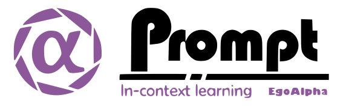

<div align="center">




 <div align="center">

 []()
 
 </div>

**An Open-Source Engineering Guide for Prompt-in-context-learning from EgoAlpha Lab.**


<!-- <h3 align="center">

    <p>Resources for prompt learning and engineering; Mastery of LLMs like ChatGPT, GPT3, FlanT5, etc.</p>

</h3> -->

<!-- <h4 align="center">
    <p>
        <a href="./README.md">English</a> |
        <a href="./chatgptprompt_zh.md">简体中文</a>
    <p>
</h4> -->

<p align="center">

  <a href="#📜-papers">📝 Papers</a> |
  <a href="./Playground.md">⚡️  Playground</a> |
  <a href="./PromptEngineering.md">🛠 Prompt Engineering</a> |
  <a href="./chatgptprompt.md">🌍 ChatGPT Prompt</a> ｜
  <a href="./langchain_guide/LangChainTutorial.ipynb">⛳ LLMs Usage Guide</a> 

</p>

</div>

<div align="center">

<!--  -->


<!--  -->

</div>

> **⭐️ Shining ⭐️:** This is fresh, daily-updated resources for in-context learning and prompt engineering. As Artificial General Intelligence (AGI) is approaching, let’s take action and become a super learner so as to position ourselves at the forefront of this exciting era and strive for personal and professional greatness.

The resources include:

*🎉[Papers](#📜-papers)🎉*:  The latest papers about *In-Context Learning*, *Prompt Engineering*, *Agent*, and *Foundation Models*. 

*🎉[Playground](./Playground.md)🎉*:  Large language models（LLMs）that enable prompt experimentation. 

*🎉[Prompt Engineering](./PromptEngineering.md)🎉*: Prompt techniques for leveraging large language models. 

*🎉[ChatGPT Prompt](./chatgptprompt.md)🎉*: Prompt examples that can be applied in our work and daily lives. 

*🎉[LLMs Usage Guide](./chatgptprompt.md)🎉*: The method for quickly getting started with large language models by using LangChain.

In the future, there will likely be two types of people on Earth (perhaps even on Mars, but that's a question for Musk): 
- Those who enhance their abilities through the use of AIGC; 
- Those whose jobs are replaced by AI automation.

```

💎EgoAlpha: Hello! human👤, are you ready?

```  


# Table of Contents
- [🔥 AI Spotlight](#-ai-spotlight-trending-research-papers)
- [📜 Papers](#-papers)
  - [Survey](#survey)
  - [Prompt Engineering](#prompt-engineering)
    - [Prompt Design](#prompt-design)
    - [Chain of Thought](#chain-of-thought)
    - [In-context Learning](#in-context-learning)
    - [Retrieval Augmented Generation](#retrieval-augmented-generation)
    - [Evaluation \& Reliability](#evaluation--reliability)
  - [Agent](#agent)
  - [Multimodal Prompt](#multimodal-prompt)
  - [Prompt Application](#prompt-application)
  - [Foundation Models](#foundation-models)
- [👨‍💻 LLM Usage](#-llm-usage)
- [✉️ Contact](#️-contact)
- [🙏 Acknowledgements](#-acknowledgements)


# 🔥 AI Spotlight: Trending Research Papers
<!-- 🔥🔥🔥 -->
<!-- ☄️ **May 1, 2025** *– Buzzing papers everyone’s talking about* -->

### **[2025-05-16]**

[**The Philosophic Turn for AI Agents: Replacing centralized digital rhetoric with decentralized truth-seeking**](https://arxiv.org/abs/2504.18601) 

<font color="gray">Philipp Koralus - [arXiv]</font>


---

[**OpenThinkIMG: Learning to Think with Images via Visual Tool Reinforcement Learning**](http://arxiv.org/pdf/2505.08617) （**New**）

<font color="gray">Zhaochen Su,Linjie Li,Mingyang Song,Yunzhuo Hao,Zhengyuan Yang,etc - [arXiv]</font>

[](https://github.com/zhaochen0110/openthinkimg)


---

[**WATCH: Weighted Adaptive Testing for Changepoint Hypotheses via Weighted-Conformal Martingales**](http://arxiv.org/abs/2505.04608) （**New**）

<font color="gray">Drew Prinster,Xing Han,Anqi Liu,Suchi Saria - [arXiv]</font>


---

[**A Survey of Interactive Generative Video**](https://arxiv.org/abs/2504.21853) （**New**）

<font color="gray">Jiwen Yu,Yiran Qin,Haoxuan Che,Quande Liu,Xintao Wang,etc - [arXiv]</font>


---

[**Fast Text-to-Audio Generation with Adversarial Post-Training**](https://arxiv.org/abs/2505.08175) （**New**）

<font color="gray">Zachary Novack,Zach Evans,Zack Zukowski,Josiah Taylor,CJ Carr,etc - [arXiv]</font>

[](https://github.com/stability-ai/stable-audio-tools)


---

[**Societal and technological progress as sewing an ever-growing, ever-changing, patchy, and polychrome quilt**](https://arxiv.org/abs/2505.05197) 

<font color="gray">Joel Z. Leibo,Alexander Sasha Vezhnevets,William A. Cunningham,Sébastien Krier,Manfred Diaz,etc - [arXiv]</font>


---

[**SkyReels-V2: Infinite-length Film Generative Model**](http://arxiv.org/pdf/2504.13074) 

<font color="gray">Guibin Chen,Dixuan Lin,Jiangping Yang,Chunze Lin,Junchen Zhu,etc - [arXiv]</font>

[](https://github.com/skyworkai/skyreels-v2)


---

[**Continuous Thought Machines**](https://arxiv.org/abs/2505.05522) 

<font color="gray">Luke Darlow,Ciaran Regan,Sebastian Risi,Jeffrey Seely,Llion Jones - [arXiv]</font>

[](https://github.com/SakanaAI/continuous-thought-machines)


---


### **[2025-05-13]**

[**The Philosophic Turn for AI Agents: Replacing centralized digital rhetoric with decentralized truth-seeking**](https://arxiv.org/abs/2504.18601) （**New**）

<font color="gray">Philipp Koralus - [arXiv]</font>


---

[**SimLingo: Vision-Only Closed-Loop Autonomous Driving with Language-Action Alignment**](https://arxiv.org/abs/2503.09594) 

<font color="gray">Katrin Renz,Long Chen,Elahe Arani,Oleg Sinavski - [arXiv]</font>

[](https://github.com/RenzKa/simlingo)


---

[**Absolute Zero: Reinforced Self-play Reasoning with Zero Data**](https://arxiv.org/abs/2505.03335) （**New**）

<font color="gray">Andrew Zhao,Yiran Wu,Yang Yue,Tong Wu,Quentin Xu,etc - [arXiv]</font>

[](https://github.com/LeapLabTHU/Absolute-Zero-Reasoner)


---

[**CoSER: Coordinating LLM-Based Persona Simulation of Established Roles**](https://arxiv.org/pdf/2502.09082) （**New**）

<font color="gray">Xintao Wang,Heng Wang,Yifei Zhang,Xinfeng Yuan,Rui Xu,etc - [arXiv]</font>

[](https://github.com/Neph0s/CoSER)


---

[**Practical Efficiency of Muon for Pretraining**](https://arxiv.org/abs/2505.02222) 

<font color="gray">Essential AI,:,Ishaan Shah,Anthony M. Polloreno,Karl Stratos,etc - [arXiv]</font>


---

[**Societal and technological progress as sewing an ever-growing, ever-changing, patchy, and polychrome quilt**](https://arxiv.org/abs/2505.05197) 

<font color="gray">Joel Z. Leibo,Alexander Sasha Vezhnevets,William A. Cunningham,Sébastien Krier,Manfred Diaz,etc - [arXiv]</font>


---

[**SkyReels-V2: Infinite-length Film Generative Model**](http://arxiv.org/pdf/2504.13074) 

<font color="gray">Guibin Chen,Dixuan Lin,Jiangping Yang,Chunze Lin,Junchen Zhu,etc - [arXiv]</font>

[](https://github.com/skyworkai/skyreels-v2)


---

[**Continuous Thought Machines**](https://arxiv.org/abs/2505.05522) （**New**）

<font color="gray">Luke Darlow,Ciaran Regan,Sebastian Risi,Jeffrey Seely,Llion Jones - [arXiv]</font>

[](https://github.com/SakanaAI/continuous-thought-machines)


---


### **[2025-05-10]**

[**SimLingo: Vision-Only Closed-Loop Autonomous Driving with Language-Action Alignment**](https://arxiv.org/abs/2503.09594) （**New**）

<font color="gray">Katrin Renz,Long Chen,Elahe Arani,Oleg Sinavski - [arXiv]</font>

[](https://github.com/RenzKa/simlingo)


---

[**Societal and technological progress as sewing an ever-growing, ever-changing, patchy, and polychrome quilt**](https://arxiv.org/abs/2505.05197) （**New**）

<font color="gray">Joel Z. Leibo,Alexander Sasha Vezhnevets,William A. Cunningham,Sébastien Krier,Manfred Diaz,etc - [arXiv]</font>


---

[**SkyReels-V2: Infinite-length Film Generative Model**](http://arxiv.org/pdf/2504.13074) 

<font color="gray">Guibin Chen,Dixuan Lin,Jiangping Yang,Chunze Lin,Junchen Zhu,etc - [arXiv]</font>

[](https://github.com/skyworkai/skyreels-v2)


---


### **[2025-05-07]**

[**Practical Efficiency of Muon for Pretraining**](https://arxiv.org/abs/2505.02222) （**New**）

<font color="gray">Essential AI,:,Ishaan Shah,Anthony M. Polloreno,Karl Stratos,etc - [arXiv]</font>


---


### **[2025-05-04]**

[**Deep Learning-based Code Reviews: A Paradigm Shift or a Double-Edged Sword?**](https://arxiv.org/abs/2411.11401) （**New**）

<font color="gray">Rosalia Tufano,Alberto Martin-Lopez,Ahmad Tayeb,Ozren Dabić,Sonia Haiduc,etc - [arXiv]</font>


---

[**Knowledge Graph Guided Evaluation of Abstention Techniques**](http://arxiv.org/abs/2412.07430) （**New**）

<font color="gray">Kinshuk Vasisht,Navreet Kaur,Danish Pruthi - [arXiv]</font>


---

[**Memorization and Knowledge Injection in Gated LLMs**](https://arxiv.org/pdf/2504.21239) （**New**）

<font color="gray">Xu Pan,Ely Hahami,Zechen Zhang,Haim Sompolinsky - [arXiv]</font>


---

[**End-to-End Conformal Calibration for Optimization Under Uncertainty**](https://arxiv.org/abs/2409.20534) 

<font color="gray">Christopher Yeh,Nicolas Christianson,Alan Wu,Adam Wierman,Yisong Yue - [arXiv]</font>

[](https://github.com/chrisyeh96/e2e-conformal)


---

[**A Practical Examination of AI-Generated Text Detectors for Large Language Models**](https://arxiv.org/abs/2412.05139) （**New**）

<font color="gray">Brian Tufts,Xuandong Zhao,Lei Li - [arXiv]</font>


---

[**SkyReels-V2: Infinite-length Film Generative Model**](http://arxiv.org/pdf/2504.13074) 

<font color="gray">Guibin Chen,Dixuan Lin,Jiangping Yang,Chunze Lin,Junchen Zhu,etc - [arXiv]</font>

[](https://github.com/skyworkai/skyreels-v2)


---


### **[2025-05-01]**

[**MentalChat16K: A Benchmark Dataset for Conversational Mental Health Assistance**](https://arxiv.org/abs/2503.13509) 

<font color="gray">Jia Xu,Tianyi Wei,Bojian Hou,Patryk Orzechowski,Shu Yang,etc - [arXiv]</font>

[](https://github.com/ChiaPatricia/MentalChat16K)


---

[**Sleep-time Compute: Beyond Inference Scaling at Test-time**](https://arxiv.org/abs/2504.13171) 

<font color="gray">Kevin Lin,Charlie Snell,Yu Wang,Charles Packer,Sarah Wooders,etc - [arXiv]</font>

[](https://github.com/letta-ai/sleep-time-compute)


---

[**End-to-End Conformal Calibration for Optimization Under Uncertainty**](https://arxiv.org/abs/2409.20534) 

<font color="gray">Christopher Yeh,Nicolas Christianson,Alan Wu,Adam Wierman,Yisong Yue - [arXiv]</font>

[](https://github.com/chrisyeh96/e2e-conformal)


---


### **[2025-04-28]**

[**MentalChat16K: A Benchmark Dataset for Conversational Mental Health Assistance**](https://arxiv.org/abs/2503.13509) 

<font color="gray">Jia Xu,Tianyi Wei,Bojian Hou,Patryk Orzechowski,Shu Yang,etc - [arXiv]</font>

[](https://github.com/ChiaPatricia/MentalChat16K)


---

[**BitNet b1.58 2B4T Technical Report**](https://arxiv.org/abs/2504.12285) 

<font color="gray">Shuming Ma,Hongyu Wang,Shaohan Huang,Xingxing Zhang,Ying Hu,etc - [arXiv]</font>


---

[**Sleep-time Compute: Beyond Inference Scaling at Test-time**](https://arxiv.org/abs/2504.13171) 

<font color="gray">Kevin Lin,Charlie Snell,Yu Wang,Charles Packer,Sarah Wooders,etc - [arXiv]</font>

[](https://github.com/letta-ai/sleep-time-compute)


---

[**End-to-End Conformal Calibration for Optimization Under Uncertainty**](https://arxiv.org/abs/2409.20534) （**New**）

<font color="gray">Christopher Yeh,Nicolas Christianson,Alan Wu,Adam Wierman,Yisong Yue - [arXiv]</font>

[](https://github.com/chrisyeh96/e2e-conformal)


---

[**Gemini 1.5: Unlocking multimodal understanding across millions of tokens of context**](https://arxiv.org/abs/2403.05530) 

<font color="gray">Gemini Team,Petko Georgiev,Ving Ian Lei,Ryan Burnell,Libin Bai,etc - [arXiv]</font>

[](https://github.com/dlvuldet/primevul)


---

[**SkyReels-V2: Infinite-length Film Generative Model**](http://arxiv.org/pdf/2504.13074) （**New**）

<font color="gray">Guibin Chen,Dixuan Lin,Jiangping Yang,Chunze Lin,Junchen Zhu,etc - [arXiv]</font>

[](https://github.com/skyworkai/skyreels-v2)


---


### **[2025-04-26]**

[**MentalChat16K: A Benchmark Dataset for Conversational Mental Health Assistance**](https://arxiv.org/abs/2503.13509) （**New**）

<font color="gray">Jia Xu,Tianyi Wei,Bojian Hou,Patryk Orzechowski,Shu Yang,etc - [arXiv]</font>

[](https://github.com/ChiaPatricia/MentalChat16K)


---

[**Sleep-time Compute: Beyond Inference Scaling at Test-time**](https://arxiv.org/abs/2504.13171) （**New**）

<font color="gray">Kevin Lin,Charlie Snell,Yu Wang,Charles Packer,Sarah Wooders,etc - [arXiv]</font>

[](https://github.com/letta-ai/sleep-time-compute)


---


### **[2025-04-22]**

[**System of Agentic AI for the Discovery of Metal-Organic Frameworks**](https://arxiv.org/abs/2504.14110) （**New**）

<font color="gray">Theo Jaffrelot Inizan,Sherry Yang,Aaron Kaplan,Yen-hsu Lin,Jian Yin,etc - [arXiv]</font>


---

[**One Model to Rig Them All: Diverse Skeleton Rigging with UniRig**](https://arxiv.org/abs/2504.12451) 

<font color="gray">Jia-Peng Zhang,Cheng-Feng Pu,Meng-Hao Guo,Yan-Pei Cao,Shi-Min Hu - [arXiv]</font>


---

[**Pushing the Limits of Large Language Model Quantization via the Linearity Theorem**](https://arxiv.org/pdf/2411.17525) （**New**）

<font color="gray">Vladimir Malinovskii,Andrei Panferov,Ivan Ilin,Han Guo,Peter Richtárik,etc - [arXiv]</font>

[](https://github.com/hanguo97/flute)


---

[**BitNet b1.58 2B4T Technical Report**](https://arxiv.org/abs/2504.12285) （**New**）

<font color="gray">Shuming Ma,Hongyu Wang,Shaohan Huang,Xingxing Zhang,Ying Hu,etc - [arXiv]</font>


---

[**Adaptive AI decision interface for autonomous electronic material discovery**](https://arxiv.org/abs/2504.13344) （**New**）

<font color="gray">Yahao Dai,Henry Chan,Aikaterini Vriza,Fredrick Kim,Yunfei Wang,etc - [arXiv]</font>


---

[**Gemini 1.5: Unlocking multimodal understanding across millions of tokens of context**](https://arxiv.org/abs/2403.05530) （**New**）

<font color="gray">Gemini Team,Petko Georgiev,Ving Ian Lei,Ryan Burnell,Libin Bai,etc - [arXiv]</font>

[](https://github.com/dlvuldet/primevul)


---

[**PooDLe: Pooled and dense self-supervised learning from naturalistic videos**](https://arxiv.org/abs/2408.11208) （**New**）

<font color="gray">Alex N. Wang,Christopher Hoang,Yuwen Xiong,Yann LeCun,Mengye Ren - [arXiv]</font>


---


### **[2025-04-19]**

[**InstantCharacter: Personalize Any Characters with a Scalable Diffusion Transformer Framework**](https://arxiv.org/abs/2504.12395) （**New**）

<font color="gray">Jiale Tao,Yanbing Zhang,Qixun Wang,Yiji Cheng,Haofan Wang,etc - [arXiv]</font>

[](https://github.com/tencent/instantcharacter)


---

[**NoisyRollout: Reinforcing Visual Reasoning with Data Augmentation**](https://arxiv.org/pdf/2504.13055) （**New**）

<font color="gray">Xiangyan Liu,Jinjie Ni,Zijian Wu,Chao Du,Longxu Dou,etc - [arXiv]</font>


---

[**One Model to Rig Them All: Diverse Skeleton Rigging with UniRig**](https://arxiv.org/abs/2504.12451) （**New**）

<font color="gray">Jia-Peng Zhang,Cheng-Feng Pu,Meng-Hao Guo,Yan-Pei Cao,Shi-Min Hu - [arXiv]</font>

[](https://github.com/VAST-AI-Research/UniRig)


---

[**Byte Latent Transformer: Patches Scale Better Than Tokens**](https://arxiv.org/pdf/2412.09871) （**New**）

<font color="gray">Artidoro Pagnoni,Ram Pasunuru,Pedro Rodriguez,John Nguyen,Benjamin Muller,etc - [arXiv]</font>

[](https://github.com/facebookresearch/blt)


---


[👉 Complete history news 👈](./historynews.md)


---

# 📜 Papers

> You can directly click on the title to jump to the corresponding PDF link location

## Survey

<div style="line-height:0.2em;">


<div style="line-height:0.2em;">


[**Motion meets Attention: Video Motion Prompts**](https://arxiv.org/abs/2407.03179) （**2024.07.03**）


[**Towards a Personal Health Large Language Model**](https://arxiv.org/abs/2406.06474) （**2024.06.10**）

  

[**Husky: A Unified, Open-Source Language Agent for Multi-Step Reasoning**](https://arxiv.org/abs/2406.06469) （**2024.06.10**）

    [](https://github.com/agent-husky/husky-v1)

[**Towards Lifelong Learning of Large Language Models: A Survey**](https://arxiv.org/abs/2406.06391) （**2024.06.10**）


[**Towards Semantic Equivalence of Tokenization in Multimodal LLM**](https://arxiv.org/abs/2406.05127) （**2024.06.07**）

  

[**LLMs Meet Multimodal Generation and Editing: A Survey**](https://doi.org/10.48550/arXiv.2405.19334) （**2024.05.29**）

  [](https://github.com/yingqinghe/awesome-llms-meet-multimodal-generation)

[**Tool Learning with Large Language Models: A Survey**](https://doi.org/10.48550/arXiv.2405.17935) （**2024.05.28**）

  [](https://github.com/quchangle1/llm-tool-survey)

[**When LLMs step into the 3D World: A Survey and Meta-Analysis of 3D Tasks via Multi-modal Large Language Models**](https://doi.org/10.48550/arXiv.2405.10255) （**2024.05.16**）

  [](https://github.com/activevisionlab/awesome-llm-3d)

[**Uncertainty Estimation and Quantification for LLMs: A Simple Supervised Approach**](https://doi.org/10.48550/arXiv.2404.15993) （**2024.04.24**）


[**A Survey on the Memory Mechanism of Large Language Model based Agents**](https://doi.org/10.48550/arXiv.2404.13501) （**2024.04.21**）

  [](https://github.com/nuster1128/llm_agent_memory_survey)


</div>

👉[Complete paper list 🔗 for "Survey"](./PaperList/survey.md)👈

## Prompt Engineering

### Prompt Design

<div style="line-height:0.2em;">


[**LLaRA: Supercharging Robot Learning Data for Vision-Language Policy**](https://arxiv.org/abs/2406.20095) （**2024.06.28**）

    [](https://github.com/lostxine/llara)

[**Dataset Size Recovery from LoRA Weights**](https://arxiv.org/abs/2406.19395) （**2024.06.27**）


[**Dual-Phase Accelerated Prompt Optimization**](https://arxiv.org/abs/2406.13443) （**2024.06.19**）


[**From RAGs to rich parameters: Probing how language models utilize external knowledge over parametric information for factual queries**](https://arxiv.org/abs/2406.12824) （**2024.06.18**）

  

[**VoCo-LLaMA: Towards Vision Compression with Large Language Models**](https://arxiv.org/abs/2406.12275) （**2024.06.18**）

    [](https://github.com/Yxxxb/VoCo-LLaMA)

[**LaMDA: Large Model Fine-Tuning via Spectrally Decomposed Low-Dimensional Adaptation**](https://arxiv.org/abs/2406.12832) （**2024.06.18**）


[**The Impact of Initialization on LoRA Finetuning Dynamics**](https://arxiv.org/abs/2406.08447) （**2024.06.12**）

  

[**An Empirical Study on Parameter-Efficient Fine-Tuning for MultiModal Large Language Models**](https://arxiv.org/abs/2406.05130) （**2024.06.07**）

  

[**Cross-Context Backdoor Attacks against Graph Prompt Learning**](https://doi.org/10.48550/arXiv.2405.17984) （**2024.05.28**）


[**Yuan 2.0-M32: Mixture of Experts with Attention Router**](https://doi.org/10.48550/arXiv.2405.17976) （**2024.05.28**）

  [](https://github.com/ieit-yuan/yuan2.0-m32)


</div>

👉[Complete paper list 🔗 for "Prompt Design"](./PaperList/PromptDesignList.md)👈

### Chain of Thought

<div style="line-height:0.2em;">


[**An Empirical Study on Parameter-Efficient Fine-Tuning for MultiModal Large Language Models**](https://arxiv.org/abs/2406.05130) （**2024.06.07**）

  

[**Cantor: Inspiring Multimodal Chain-of-Thought of MLLM**](https://doi.org/10.48550/arXiv.2404.16033) （**2024.04.24**）


[**nicolay-r at SemEval-2024 Task 3: Using Flan-T5 for Reasoning Emotion Cause in Conversations with Chain-of-Thought on Emotion States**](https://arxiv.org/abs/2404.03361) （**2024.04.04**）

  [](https://github.com/nicolay-r/thor-ecac)

[**Visualization-of-Thought Elicits Spatial Reasoning in Large Language Models**](https://arxiv.org/abs/2404.03622) （**2024.04.04**）

  

[**Can Small Language Models Help Large Language Models Reason Better?: LM-Guided Chain-of-Thought**](https://arxiv.org/abs/2404.03414) （**2024.04.04**）

  

[**Visual CoT: Unleashing Chain-of-Thought Reasoning in Multi-Modal Language Models**](https://arxiv.org/abs/2403.16999) （**2024.03.25**）

    [](https://github.com/deepcs233/visual-cot)

[**A Chain-of-Thought Prompting Approach with LLMs for Evaluating Students' Formative Assessment Responses in Science**](https://arxiv.org/abs/2403.14565) （**2024.03.21**）


[**NavCoT: Boosting LLM-Based Vision-and-Language Navigation via Learning Disentangled Reasoning**](https://arxiv.org/abs/2403.07376) （**2024.03.12**）

    [](https://github.com/expectorlin/navcot)

[**ERA-CoT: Improving Chain-of-Thought through Entity Relationship Analysis**](https://arxiv.org/abs/2403.06932) （**2024.03.11**）

    [](https://github.com/oceanntwt/era-cot)

[**Bias-Augmented Consistency Training Reduces Biased Reasoning in Chain-of-Thought**](https://arxiv.org/abs/2403.05518) （**2024.03.08**）


</div>

👉[Complete paper list 🔗 for "Chain of Thought"](./PaperList/ChainofThoughtList.md)👈

### In-context Learning

<div style="line-height:0.2em;">


[**LaMDA: Large Model Fine-Tuning via Spectrally Decomposed Low-Dimensional Adaptation**](https://arxiv.org/abs/2406.12832) （**2024.06.18**）


[**The Impact of Initialization on LoRA Finetuning Dynamics**](https://arxiv.org/abs/2406.08447) （**2024.06.12**）

  

[**An Empirical Study on Parameter-Efficient Fine-Tuning for MultiModal Large Language Models**](https://arxiv.org/abs/2406.05130) （**2024.06.07**）

  

[**Leveraging Visual Tokens for Extended Text Contexts in Multi-Modal Learning**](https://arxiv.org/abs/2406.02547) （**2024.06.04**）

  [](https://github.com/showlab/VisInContext)

[**Learning to grok: Emergence of in-context learning and skill composition in modular arithmetic tasks**](https://arxiv.org/abs/2406.02550) （**2024.06.04**）

    [](https://github.com/ablghtianyi/ICL_Modular_Arithmetic)

[**Long Context is Not Long at All: A Prospector of Long-Dependency Data for Large Language Models**](https://doi.org/10.48550/arXiv.2405.17915) （**2024.05.28**）

  [](https://github.com/October2001/ProLong)

[**Efficient Prompt Tuning by Multi-Space Projection and Prompt Fusion**](https://doi.org/10.48550/arXiv.2405.11464) （**2024.05.19**）


[**MAML-en-LLM: Model Agnostic Meta-Training of LLMs for Improved In-Context Learning**](https://doi.org/10.48550/arXiv.2405.11446) （**2024.05.19**）


[**Improving Diversity of Commonsense Generation by Large Language Models via In-Context Learning**](https://doi.org/10.48550/arXiv.2404.16807) （**2024.04.25**）


[**Stronger Random Baselines for In-Context Learning**](https://doi.org/10.48550/arXiv.2404.13020) （**2024.04.19**）

  [](https://github.com/gyauney/max-random-baseline)


</div>

👉[Complete paper list 🔗 for "In-context Learning"](./PaperList/InContextLearningList.md)👈


### Retrieval Augmented Generation

<div style="line-height:0.2em;">


[**Retrieval-Augmented Mixture of LoRA Experts for Uploadable Machine Learning**](https://arxiv.org/abs/2406.16989) （**2024.06.24**）


[**Enhancing RAG Systems: A Survey of Optimization Strategies for Performance and Scalability**](https://doi.org/10.55041/ijsrem35402) （**2024.06.04**）


[**Enhancing Noise Robustness of Retrieval-Augmented Language Models with Adaptive Adversarial Training**](https://doi.org/10.48550/arXiv.2405.20978) （**2024.05.31**）


[**Accelerating Inference of Retrieval-Augmented Generation via Sparse Context Selection**](https://doi.org/10.48550/arXiv.2405.16178) （**2024.05.25**）


[**DocReLM: Mastering Document Retrieval with Language Model**](https://doi.org/10.48550/arXiv.2405.11461) （**2024.05.19**）


[**UniRAG: Universal Retrieval Augmentation for Multi-Modal Large Language Models**](https://doi.org/10.48550/arXiv.2405.10311) （**2024.05.16**）


[**ChatHuman: Language-driven 3D Human Understanding with Retrieval-Augmented Tool Reasoning**](https://doi.org/10.48550/arXiv.2405.04533) （**2024.05.07**）


[**REASONS: A benchmark for REtrieval and Automated citationS Of scieNtific Sentences using Public and Proprietary LLMs**](https://doi.org/10.48550/arXiv.2405.02228) （**2024.05.03**）


[**Superposition Prompting: Improving and Accelerating Retrieval-Augmented Generation**](https://arxiv.org/abs/2404.06910) （**2024.04.10**）

  

[**Untangle the KNOT: Interweaving Conflicting Knowledge and Reasoning Skills in Large Language Models**](https://arxiv.org/abs/2404.03577) （**2024.04.04**）

  [](https://github.com/thu-keg/knot)


</div>

👉[Complete paper list 🔗 for "Retrieval Augmented Generation"](./PaperList/KnowledgeAugmentedPromptList.md)👈


### Evaluation & Reliability

<div style="line-height:0.2em;">


[**CELLO: Causal Evaluation of Large Vision-Language Models**](https://arxiv.org/abs/2406.19131) （**2024.06.27**）

  [](https://github.com/opencausalab/cello)

[**PrExMe! Large Scale Prompt Exploration of Open Source LLMs for Machine Translation and Summarization Evaluation**](https://arxiv.org/abs/2406.18528) （**2024.06.26**）


[**Revisiting Referring Expression Comprehension Evaluation in the Era of Large Multimodal Models**](https://arxiv.org/abs/2406.16866) （**2024.06.24**）

  [](https://github.com/jierunchen/ref-l4)

[**OR-Bench: An Over-Refusal Benchmark for Large Language Models**](https://doi.org/10.48550/arXiv.2405.20947) （**2024.05.31**）


[**TimeChara: Evaluating Point-in-Time Character Hallucination of Role-Playing Large Language Models**](https://doi.org/10.48550/arXiv.2405.18027) （**2024.05.28**）


[**Subtle Biases Need Subtler Measures: Dual Metrics for Evaluating Representative and Affinity Bias in Large Language Models**](https://doi.org/10.48550/arXiv.2405.14555) （**2024.05.23**）


[**HW-GPT-Bench: Hardware-Aware Architecture Benchmark for Language Models**](https://doi.org/10.48550/arXiv.2405.10299) （**2024.05.16**）

  [](https://github.com/automl/hw-gpt-bench)

[**Multimodal LLMs Struggle with Basic Visual Network Analysis: a VNA Benchmark**](https://doi.org/10.48550/arXiv.2405.06634) （**2024.05.10**）

  [](https://github.com/evanup/vna_benchmark)

[**Vibe-Eval: A hard evaluation suite for measuring progress of multimodal language models**](https://doi.org/10.48550/arXiv.2405.02287) （**2024.05.03**）

  [](https://github.com/reka-ai/reka-vibe-eval)

[**Causal Evaluation of Language Models**](https://doi.org/10.48550/arXiv.2405.00622) （**2024.05.01**）

  [](https://github.com/OpenCausaLab/CaLM)


</div>

👉[Complete paper list 🔗 for "Evaluation & Reliability"](./PaperList/EvaluationReliabilityList.md)👈

## Agent

<div style="line-height:0.2em;">


[**Cooperative Multi-Agent Deep Reinforcement Learning Methods for UAV-aided Mobile Edge Computing Networks**](https://arxiv.org/abs/2407.03280) （**2024.07.03**）


[**Symbolic Learning Enables Self-Evolving Agents**](https://arxiv.org/abs/2406.18532) （**2024.06.26**）

    [](https://github.com/aiwaves-cn/agents)

[**Adversarial Attacks on Multimodal Agents**](https://arxiv.org/abs/2406.12814) （**2024.06.18**）

    [](https://github.com/chenwu98/agent-attack)

[**DigiRL: Training In-The-Wild Device-Control Agents with Autonomous Reinforcement Learning**](https://arxiv.org/abs/2406.11896) （**2024.06.14**）

  

[**Transforming Wearable Data into Health Insights using Large Language Model Agents**](https://arxiv.org/abs/2406.06464) （**2024.06.10**）

  

[**Neuromorphic dreaming: A pathway to efficient learning in artificial agents**](https://doi.org/10.48550/arXiv.2405.15616) （**2024.05.24**）


[**Fine-Tuning Large Vision-Language Models as Decision-Making Agents via Reinforcement Learning**](https://doi.org/10.48550/arXiv.2405.10292) （**2024.05.16**）


[**Learning Multi-Agent Communication from Graph Modeling Perspective**](https://doi.org/10.48550/arXiv.2405.08550) （**2024.05.14**）

  [](https://github.com/charleshsc/CommFormer)

[**Smurfs: Leveraging Multiple Proficiency Agents with Context-Efficiency for Tool Planning**](https://doi.org/10.48550/arXiv.2405.05955) （**2024.05.09**）

  [](https://github.com/freedomintelligence/smurfs)

[**Unveiling Disparities in Web Task Handling Between Human and Web Agent**](https://doi.org/10.48550/arXiv.2405.04497) （**2024.05.07**）


</div>

👉[Complete paper list 🔗 for "Agent"](./PaperList/AgentList.md)👈

## Multimodal Prompt

<div style="line-height:0.2em;">


[**InternLM-XComposer-2.5: A Versatile Large Vision Language Model Supporting Long-Contextual Input and Output**](https://arxiv.org/abs/2407.03320) （**2024.07.03**）

    [](https://github.com/internlm/internlm-xcomposer)

[**LLaRA: Supercharging Robot Learning Data for Vision-Language Policy**](https://arxiv.org/abs/2406.20095) （**2024.06.28**）

    [](https://github.com/lostxine/llara)

[**Web2Code: A Large-scale Webpage-to-Code Dataset and Evaluation Framework for Multimodal LLMs**](https://arxiv.org/abs/2406.20098) （**2024.06.28**）

  [](https://github.com/mbzuai-llm/web2code)

[**LLaVolta: Efficient Multi-modal Models via Stage-wise Visual Context Compression**](https://arxiv.org/abs/2406.20092) （**2024.06.28**）

  [](https://github.com/beckschen/llavolta)

[**Cambrian-1: A Fully Open, Vision-Centric Exploration of Multimodal LLMs**](https://arxiv.org/abs/2406.16860) （**2024.06.24**）

    [](https://github.com/cambrian-mllm/cambrian)

[**VoCo-LLaMA: Towards Vision Compression with Large Language Models**](https://arxiv.org/abs/2406.12275) （**2024.06.18**）

    [](https://github.com/Yxxxb/VoCo-LLaMA)

[**Beyond LLaVA-HD: Diving into High-Resolution Large Multimodal Models**](https://arxiv.org/abs/2406.08487) （**2024.06.12**）

    [](https://github.com/yfzhang114/slime)

[**An Empirical Study on Parameter-Efficient Fine-Tuning for MultiModal Large Language Models**](https://arxiv.org/abs/2406.05130) （**2024.06.07**）

  

[**Leveraging Visual Tokens for Extended Text Contexts in Multi-Modal Learning**](https://arxiv.org/abs/2406.02547) （**2024.06.04**）

  [](https://github.com/showlab/VisInContext)

[**DeCo: Decoupling Token Compression from Semantic Abstraction in Multimodal Large Language Models**](https://doi.org/10.48550/arXiv.2405.20985) （**2024.05.31**）


</div>

👉[Complete paper list 🔗 for "Multimodal Prompt"](./PaperList/multimodalprompt.md)👈

## Prompt Application

<div style="line-height:0.2em;">


[**IncogniText: Privacy-enhancing Conditional Text Anonymization via LLM-based Private Attribute Randomization**](https://arxiv.org/abs/2407.02956) （**2024.07.03**）


[**Web2Code: A Large-scale Webpage-to-Code Dataset and Evaluation Framework for Multimodal LLMs**](https://arxiv.org/abs/2406.20098) （**2024.06.28**）

  [](https://github.com/mbzuai-llm/web2code)

[**OMG-LLaVA: Bridging Image-level, Object-level, Pixel-level Reasoning and Understanding**](https://arxiv.org/abs/2406.19389) （**2024.06.27**）

    [](https://github.com/lxtgh/omg-seg)

[**Adversarial Search Engine Optimization for Large Language Models**](https://arxiv.org/abs/2406.18382) （**2024.06.26**）


[**VideoLLM-online: Online Video Large Language Model for Streaming Video**](https://arxiv.org/abs/2406.11816) （**2024.06.17**）


[**Regularizing Hidden States Enables Learning Generalizable Reward Model for LLMs**](https://arxiv.org/abs/2406.10216) （**2024.06.14**）


[**Autoregressive Model Beats Diffusion: Llama for Scalable Image Generation**](https://arxiv.org/abs/2406.06525) （**2024.06.10**）

    [](https://github.com/foundationvision/llamagen)

[**Language models emulate certain cognitive profiles: An investigation of how predictability measures interact with individual differences**](https://arxiv.org/abs/2406.04988) （**2024.06.07**）


[**PaCE: Parsimonious Concept Engineering for Large Language Models**](https://arxiv.org/abs/2406.04331) （**2024.06.06**）

    [](https://github.com/peterljq/parsimonious-concept-engineering)

[**Yuan 2.0-M32: Mixture of Experts with Attention Router**](https://doi.org/10.48550/arXiv.2405.17976) （**2024.05.28**）

  [](https://github.com/ieit-yuan/yuan2.0-m32)


</div>

👉[Complete paper list 🔗 for "Prompt Application"](./PaperList/promptapplication.md)👈

## Foundation Models

<div style="line-height:0.2em;">


[**TheoremLlama: Transforming General-Purpose LLMs into Lean4 Experts**](https://arxiv.org/abs/2407.03203) （**2024.07.03**）


[**Pedestrian 3D Shape Understanding for Person Re-Identification via Multi-View Learning**](https://doi.org/10.1109/TCSVT.2024.3358850) （**2024.07.01**）


[**Token Erasure as a Footprint of Implicit Vocabulary Items in LLMs**](https://arxiv.org/abs/2406.20086) （**2024.06.28**）


[**OMG-LLaVA: Bridging Image-level, Object-level, Pixel-level Reasoning and Understanding**](https://arxiv.org/abs/2406.19389) （**2024.06.27**）

    [](https://github.com/lxtgh/omg-seg)

[**Fundamental Problems With Model Editing: How Should Rational Belief Revision Work in LLMs?**](https://arxiv.org/abs/2406.19354) （**2024.06.27**）

  

[**Efficient World Models with Context-Aware Tokenization**](https://arxiv.org/abs/2406.19320) （**2024.06.27**）

    [](https://github.com/vmicheli/delta-iris)

[**The Remarkable Robustness of LLMs: Stages of Inference?**](https://arxiv.org/abs/2406.19384) （**2024.06.27**）

  

[**ResumeAtlas: Revisiting Resume Classification with Large-Scale Datasets and Large Language Models**](https://arxiv.org/abs/2406.18125) （**2024.06.26**）

  [](https://github.com/noran-mohamed/Resume-Classification-Dataset)

[**AITTI: Learning Adaptive Inclusive Token for Text-to-Image Generation**](https://arxiv.org/abs/2406.12805) （**2024.06.18**）

    [](https://github.com/itsmag11/aitti)

[**Unveiling Encoder-Free Vision-Language Models**](https://arxiv.org/abs/2406.11832) （**2024.06.17**）

    [](https://github.com/baaivision/eve)


</div>

👉[Complete paper list 🔗 for "Foundation Models"](./PaperList/foundationmodels.md)👈

<!-- ### 📌 Hard Prompt/ Discrete Prompt

<div style="line-height:0.2em;">


[**Winner-Take-All Column Row Sampling for Memory Efficient Adaptation of Language Model**](https://arxiv.org/abs/2305.15265) （**2023.05.24**）

  [](https://github.com/zirui-ray-liu/wtacrs)

[**How to Distill your BERT: An Empirical Study on the Impact of Weight Initialisation and Distillation Objectives**](https://arxiv.org/abs/2305.15032) （**2023.05.24**）

    [](https://github.com/mainlp/how-to-distill-your-bert)

[**ChatAgri: Exploring Potentials of ChatGPT on Cross-linguistic Agricultural Text Classification**](https://arxiv.org/abs/2305.15024) （**2023.05.24**）

    [](https://github.com/albert-jin/agricultural_textual_classification_chatgpt)

[**Cheap and Quick: Efficient Vision-Language Instruction Tuning for Large Language Models**](https://arxiv.org/abs/2305.15023) （**2023.05.24**）

    [](https://github.com/luogen1996/lavin)

[**LLMDet: A Large Language Models Detection Tool**](https://arxiv.org/abs/2305.15004) （**2023.05.24**）

  

[**OverPrompt: Enhancing ChatGPT Capabilities through an Efficient In-Context Learning Approach**](https://arxiv.org/abs/2305.14973) （**2023.05.24**）

  

[**Interpretable by Design Visual Question Answering**](https://arxiv.org/abs/2305.14882) （**2023.05.24**）

  

[**In-Context Demonstration Selection with Cross Entropy Difference**](https://arxiv.org/abs/2305.14726) （**2023.05.24**）

    [](https://github.com/microsoft/lmops)

[**LogicLLM: Exploring Self-supervised Logic-enhanced Training for Large Language Models**](https://arxiv.org/abs/2305.13718) （**2023.05.23**）

  

[**Enhancing Cross-lingual Natural Language Inference by Soft Prompting with Multilingual Verbalizer**](https://arxiv.org/abs/2305.12761) （**2023.05.22**）

    [](https://github.com/thu-bpm/softmv)


</div>

👉[Complete paper list 🔗 for "Hard Prompt"](./PaperList/HardPromptList.md)👈

### 📌 Soft Prompt/ Continuous Prompt

<div style="line-height:0.2em;">


</div>

👉[Complete paper list 🔗 for "Soft Prompt"](./PaperList/SoftPromptList.md)👈 -->

<!-- ## Prompt for Knowledge Graph

// __PAPER_LIST__:{field:'Prompt Design',size:10,state:'corrected',type:'lite'}

👉[Complete paper list 🔗 for "Prompt for Knowledge Graph"](./PaperList/PromptKnowledgeGraphList.md)👈 --> 


<!-- # 🎓 Citation

If you find our work helps, please star our project and cite our paper. Thanks a lot!

```

综述论文可以放在这个位置

``` -->

<!--  -->

# 👨‍💻 LLM Usage
Large language models (LLMs) are becoming a revolutionary technology that is shaping the development of our era. Developers can create applications that were previously only possible in our imaginations by building LLMs. However, using these LLMs often comes with certain technical barriers, and even at the introductory stage, people may be intimidated by cutting-edge technology: Do you have any questions like the following?

- ❓ *How can LLM be built using programming?* 
- ❓ *How can it be used and deployed in your own programs?* 

💡 If there was a tutorial that could be accessible to all audiences, not just computer science professionals, it would provide detailed and comprehensive guidance to quickly get started and operate in a short amount of time, ultimately achieving the goal of being able to use LLMs flexibly and creatively to build the programs they envision. And now, just for you: the most detailed and comprehensive Langchain beginner's guide, sourced from the official langchain website but with further adjustments to the content, accompanied by the most detailed and annotated code examples, teaching code lines by line and sentence by sentence to all audiences.

**Click 👉[here](./langchain_guide/LangChainTutorial.ipynb)👈 to take a quick tour of getting started with LLM.**


# ✉️ Contact

This repo is maintained by [EgoAlpha Lab](https://github.com/EgoAlpha). Questions and discussions are welcome via `helloegoalpha@gmail.com`.

We are willing to engage in discussions with friends from the academic and industrial communities, and explore the latest developments in prompt engineering and in-context learning together.


# 🙏 Acknowledgements

Thanks to the PhD students from [EgoAlpha Lab](https://github.com/EgoAlpha) and other workers who participated in this repo. We will improve the project in the follow-up period and maintain this community well. We also would like to express our sincere gratitude to the authors of the relevant resources. Your efforts have broadened our horizons and enabled us to perceive a more wonderful world.


<!--  -->

<!-- # 👨‍👩‍👧‍👦 Contributors

## Main Contributors
* [Yu Liu]()
* [Yifei Cao](https://github.com/cyfedu1024)
* [Jizhe Yu]()
* [Yuan Yao]()
* [He Qi]() -->


<!-- ## Guest Contributors
* [No] -->

<!-- 

# 📔 License

This project is open source and available under the MIT

<div align="center">

</div> -->
