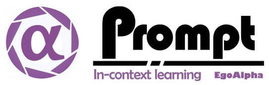

<div align="center">



 <div align="center">
    <a href="https://blog.sunguoqi.com/">
      
    </a>
  </div>

**An Open-Source Engineering Guide for Prompt-in-context-learning from EgoAlpha Lab.**


<!-- <h3 align="center">
    <p>Resources for prompt learning and engineering; Mastery of LLMs like ChatGPT, GPT3, FlanT5, etc.</p>
</h3> -->
<h4 align="center">
    <p>
        <a href="./README.md">English</a> |
        <a href="./README_zh.md">简体中文</a>
    <p>
</h4>
<p align="center">
  <a href="#papers📜">📝 Papers</a> |
  <a href="./Playground.md">⚡️  Playground</a> |
  <a href="./Promptzoo.md">🛠 Prompt Zoo</a> |
  <a href="./chatgptprompt.md">🌍 ChatGPT Prompt</a> 
</p>
</div>

<div align="center">

<!--  -->

<!--  -->
</div>


> **⭐️ Shining ⭐️:** This is fresh, daily-updated resources for in-context learning and prompt engineering. As Artificial General Intelligence (AGI) is approaching, let’s take action and become a super learner so as to position ourselves at the forefront of this exciting era and strive for personal and professional greatness.

The resources include:

*🎉[Papers](#papers📜)🎉*:  The latest papers about in-context learning or prompt engineering. 

*🎉[Playground](./Playground.md)🎉*:  Large language models that enable prompt experimentation. 

*🎉[Prompt Zoo](./Promptzoo.md)🎉*: Prompt techniques for leveraging large language models. 

*🎉[ChatGPT Prompt](./chatgptprompt.md)🎉*: Prompt examples that can be applied in our work and daily lives. 

In the future, there will likely be two types of people on Earth (perhaps even on Mars, but that's a question for Musk): Those who enhance their abilities through the use of AI; 
Those whose jobs are replaced by AI automation.

```
💎EgoAlpha: Hello! human👤, are you ready?
```  

# 📢 News

- **[2023.3.4]** We establish this project that is organised by professor Yu Liu from EgoAlpha Lab.


# Papers📜

- [Prompt Engineering](#prompt-engineering)
- [In-context learning](#in-context-learning)
- [Multimodal Prompt](#multimodal-prompt)
- [Knowledge Augmented Prompts](#knowledge-augmented-prompts)
- [Prompt for Knowledge Graph](#prompt-for-knowledge-graph)

---

## Prompt Engineering

### 📌 Prompt Design

[**UniPELT: A Unified Framework for Parameter-Efficient Language Model Tuning**](https://doi.org/10.18653/v1/2022.acl-long.433) 👨‍🎓Yuning Mao,Lambert Mathias,Rui Hou,Amjad Almahairi,Hao Ma,Jiawei Han,Wen-tau Yih,Madian Khabsa 2021 

[**HETFORMER: Heterogeneous Transformer with Sparse Attention for Long-Text Extractive Summarization**](https://doi.org/10.18653/v1/2021.emnlp-main.13) 👨‍🎓Ye Liu,Jianguo Zhang,Yao Wan,Congying Xia,Lifang He,Philip S. Yu 2021 

[**Can Language Models be Biomedical Knowledge Bases?**](https://doi.org/10.18653/v1/2021.emnlp-main.388) 👨‍🎓Mujeen Sung,Jinhyuk Lee,Sean S. Yi,Minji Jeon,Sungdong Kim,Jaewoo Kang 2021 

[**The SelectGen Challenge: Finding the Best Training Samples for Few-Shot Neural Text Generation**](https://arxiv.org/abs/2302.135402108.06614) 👨‍🎓Ernie Chang,Xiaoyu Shen,Alex Marin,V. Demberg 2021 

[**Pre-train, Prompt, and Predict: A Systematic Survey of Prompting Methods in Natural Language Processing**](https://doi.org/10.1145/3560815) 👨‍🎓Pengfei Liu,Weizhe Yuan,Jinlan Fu,Zhengbao Jiang,Hiroaki Hayashi,Graham Neubig 2021 

[**On Training Instance Selection for Few-Shot Neural Text Generation**](https://doi.org/10.18653/v1/2021.acl-short.2) 👨‍🎓Ernie Chang,Xiaoyu Shen,Hui-Syuan Yeh,V. Demberg 2021 

[**Template-Based Named Entity Recognition Using BART**](https://doi.org/10.18653/v1/2021.findings-acl.161) 👨‍🎓Leyang Cui,Yu Wu,Jian Liu,Sen Yang,Yue Zhang 2021 

[**Enriching Transformers with Structured Tensor-Product Representations for Abstractive Summarization**](https://doi.org/10.18653/V1/2021.NAACL-MAIN.381) 👨‍🎓Yichen Jiang,Asli Celikyilmaz,P. Smolensky,Paul Soulos,Sudha Rao,H. Palangi,Roland Fernandez,Caitlin Smith,Mohit Bansal,Jianfeng Gao 2021 

[**SciFive: a text-to-text transformer model for biomedical literature**](https://arxiv.org/abs/2302.135402106.03598) 👨‍🎓Long Phan,J. Anibal,Hieu Tran,Shaurya Chanana,Erol Bahadroglu,Alec Peltekian,G. Altan-Bonnet 2021 

[**PTR: Prompt Tuning with Rules for Text Classification**](https://doi.org/10.1016/j.aiopen.2022.11.003) 👨‍🎓Xu Han,Weilin Zhao,Ning Ding,Zhiyuan Liu,Maosong Sun 2021 


-----------------------------------------👉[Complete paper list 🔗 for "prompt design"](./PaperList/PromptDesignList.md)👈--------------------------------------------------

### 📌 Automatic Prompt 

[**Active Example Selection for In-Context Learning**](https://doi.org/10.48550/arXiv.2211.04486) 👨‍🎓Yiming Zhang,Shi Feng,Chenhao Tan 2022 

[**Large Language Models Can Self-Improve**](https://doi.org/10.48550/arXiv.2210.11610) 👨‍🎓Jiaxin Huang,S. Gu,Le Hou,Yuexin Wu,Xuezhi Wang,Hongkun Yu,Jiawei Han 2022 

[**Automatic Chain of Thought Prompting in Large Language Models**](https://doi.org/10.48550/arXiv.2210.03493) 👨‍🎓Zhuosheng Zhang,Aston Zhang,Mu Li,Alexander J. Smola 2022 

[**Complexity-Based Prompting for Multi-Step Reasoning**](https://doi.org/10.48550/arXiv.2210.00720) 👨‍🎓Yao Fu,Hao-Chun Peng,Ashish Sabharwal,Peter Clark,Tushar Khot 2022 

[**Dynamic Prompt Learning via Policy Gradient for Semi-structured Mathematical Reasoning**](https://doi.org/10.48550/arXiv.2209.14610) 👨‍🎓Pan Lu,Liang Qiu,Kai-Wei Chang,Y. Wu,Song-Chun Zhu,Tanmay Rajpurohit,Peter Clark,A. Kalyan 2022 

[**Selective Annotation Makes Language Models Better Few-Shot Learners**](https://doi.org/10.48550/arXiv.2209.01975) 👨‍🎓Hongjin Su,Jungo Kasai,Chen Henry Wu,Weijia Shi,Tianlu Wang,Jiayi Xin,Rui Zhang,Mari Ostendorf,Luke Zettlemoyer,Noah A. Smith,Tao Yu 2022 

[**Interactive and Visual Prompt Engineering for Ad-hoc Task Adaptation with Large Language Models**](https://doi.org/10.1109/TVCG.2022.3209479) 👨‍🎓Hendrik Strobelt,Albert Webson,Victor Sanh,Benjamin Hoover,J. Beyer,H. Pfister,Alexander M. Rush 2022 

[**Exploring CLIP for Assessing the Look and Feel of Images**](https://doi.org/10.48550/arXiv.2207.12396) 👨‍🎓Jianyi Wang,Kelvin C. K. Chan,Chen Change Loy 2022 

[**Rationale-Augmented Ensembles in Language Models**](https://doi.org/10.48550/arXiv.2207.00747) 👨‍🎓Xuezhi Wang,Jason Wei,D. Schuurmans,Quoc Le,E. Chi,Denny Zhou 2022 

[**Initial Images: Using Image Prompts to Improve Subject Representation in Multimodal AI Generated Art**](https://doi.org/10.1145/3527927.3532792) 👨‍🎓Han Qiao,Vivian Liu,Lydia B. Chilton 2022 


👉[Complete paper list 🔗 for "Automatic Prompt"](./PaperList/AutomaticPromptList.md)👈

### 📌 Chain of Thought

[**Large Language Models Are Reasoning Teachers**](https://doi.org/10.48550/arXiv.2212.10071) 👨‍🎓Namgyu Ho,Laura Schmid,Se-Young Yun 2022 

[**Teaching Small Language Models to Reason**](https://doi.org/10.48550/arXiv.2212.08410) 👨‍🎓Lucie Charlotte Magister,Jonathan Mallinson,Jakub Adamek,Eric Malmi,Aliaksei Severyn 2022 

[**The Impact of Symbolic Representations on In-context Learning for Few-shot Reasoning**](https://doi.org/10.48550/arXiv.2212.08686) 👨‍🎓Hanlin Zhang,Yi-Fan Zhang,Li Erran Li,Eric Xing 2022 

[**Complementary Explanations for Effective In-Context Learning**](https://doi.org/10.48550/arXiv.2211.13892) 👨‍🎓Xi Ye,Srini Iyer,Asli Celikyilmaz,V. Stoyanov,Greg Durrett,Ramakanth Pasunuru 2022 

[**PAL: Program-aided Language Models**](https://doi.org/10.48550/arXiv.2211.10435) 👨‍🎓Luyu Gao,Aman Madaan,Shuyan Zhou,Uri Alon,Pengfei Liu,Yiming Yang,Jamie Callan,Graham Neubig 2022 

[**Active Example Selection for In-Context Learning**](https://doi.org/10.48550/arXiv.2211.04486) 👨‍🎓Yiming Zhang,Shi Feng,Chenhao Tan 2022 

[**Large Language Models Can Self-Improve**](https://doi.org/10.48550/arXiv.2210.11610) 👨‍🎓Jiaxin Huang,S. Gu,Le Hou,Yuexin Wu,Xuezhi Wang,Hongkun Yu,Jiawei Han 2022 

[**Scaling Instruction-Finetuned Language Models**](https://doi.org/10.48550/arXiv.2210.11416) 👨‍🎓Hyung Won Chung,Le Hou,S. Longpre,Barret Zoph,Yi Tay,W. Fedus,Eric Li,Xuezhi Wang,M. Dehghani,Siddhartha Brahma,Albert Webson,S. Gu,Zhuyun Dai,Mirac Suzgun,Xinyun Chen,Aakanksha Chowdhery,Dasha Valter,Sharan Narang,Gaurav Mishra,A. Yu,Vincent Zhao,Yanping Huang,Andrew M. Dai,Hongkun Yu,Slav Petrov,E. Chi,J. Dean,Jacob Devlin,Adam Roberts,Denny Zhou,Quoc V. Le,Jason Wei 2022 

[**Challenging BIG-Bench Tasks and Whether Chain-of-Thought Can Solve Them**](https://doi.org/10.48550/arXiv.2210.09261) 👨‍🎓Mirac Suzgun,Nathan Scales,Nathanael Scharli,Sebastian Gehrmann,Yi Tay,Hyung Won Chung,Aakanksha Chowdhery,Quoc V. Le,E. Chi,Denny Zhou,Jason Wei 2022 

[**Prompting GPT-3 To Be Reliable**](https://doi.org/10.48550/arXiv.2210.09150) 👨‍🎓Chenglei Si,Zhe Gan,Zhengyuan Yang,Shuohang Wang,Jianfeng Wang,Jordan L. Boyd-Graber,Lijuan Wang 2022 


👉[Complete paper list 🔗 for "Chain of Thought"](./PaperList/ChainofThoughtList.md)👈

### 📌 Evaluation & Reliability

[**Relay Node Placement in Wireless Sensor Networks With Respect to Delay and Reliability Requirements**](https://doi.org/10.1109/JSYST.2018.2838072) 👨‍🎓Chaofan Ma,W. Liang,M. Zheng,Bofu Yang 2019 

[**Comparative Analysis of Transmission Power Level and Packet Size Optimization Strategies for WSNs**](https://doi.org/10.1109/JSYST.2018.2864941) 👨‍🎓Huseyin Ugur Yildiz,Sinan Kurt,B. Tavli 2019 

[**RBD Model-Based Approach for Reliability Assessment in Complex Systems**](https://doi.org/10.1109/JSYST.2018.2840220) 👨‍🎓M. Catelani,L. Ciani,M. Venzi 2019 

[**Joint Transmission Power Optimization and Connectivity Control in Asymmetric Networks**](https://doi.org/10.23919/ACC.2018.8431490) 👨‍🎓Milad Esmacilpour,A. Aghdam,S. Blouin 2018 

[**Reliability Allocation Procedures in Complex Redundant Systems**](https://doi.org/10.1109/JSYST.2017.2651161) 👨‍🎓M. Catelani,L. Ciani,G. Patrizi,M. Venzi 2018 

[**Device-to-Device Communications: A Performance Analysis in the Context of Social Comparison-Based Relaying**](https://doi.org/10.1109/TWC.2017.2751470) 👨‍🎓Young Jin Chun,Gualtiero Colombo,S. Cotton,W. Scanlon,R. Whitaker,S. Allen 2017 

[**MIMO Wireless Communications over Generalized Fading Channels**](https://doi.org/10.1201/9781315116778) 👨‍🎓B. Kumbhani,R. Kshetrimayum 2017 

[**Energy Saving With Network Coding Design Over Rayleigh Fading Channel**](https://doi.org/10.1109/TWC.2017.2699188) 👨‍🎓Shijun Lin,Liqun Fu,Yong Li 2017 

[**Optimal WSN Deployment Models for Air Pollution Monitoring**](https://doi.org/10.1109/TWC.2017.2658601) 👨‍🎓Ahmed Boubrima,Walid Bechkit,H. Rivano 2017 

[**Distance distribution between nodes in a 3D wireless network**](https://doi.org/10.1016/j.jpdc.2016.09.006) 👨‍🎓J. Nichols,J. Michalowicz 2017 


👉[Complete paper list 🔗 for "Evaluation & Reliability"](./PaperList/EvaluationReliabilityList.md)👈

## In-context Learning

[**Large Language Models Are Implicitly Topic Models: Explaining and Finding Good Demonstrations for In-Context Learning**](https://doi.org/10.48550/arXiv.2301.11916) 👨‍🎓Xinyi Wang,Wanrong Zhu,William Yang Wang 2023 

[**OPT-IML: Scaling Language Model Instruction Meta Learning through the Lens of Generalization**](https://doi.org/10.48550/arXiv.2212.12017) 👨‍🎓S. Iyer,Xiaojuan Lin,Ramakanth Pasunuru,Todor Mihaylov,Daniel Simig,Ping Yu,Kurt Shuster,Tianlu Wang,Qing Liu,Punit Singh Koura,Xian Li,Brian O'Horo,Gabriel Pereyra,Jeff Wang,Christopher Dewan,Asli Celikyilmaz,Luke Zettlemoyer,Veselin Stoyanov 2022 

[**Prompt-Augmented Linear Probing: Scaling Beyond The Limit of Few-shot In-Context Learners**](https://doi.org/10.48550/arXiv.2212.10873) 👨‍🎓Hyunsoo Cho,Hyuhng Joon Kim,Junyeob Kim,Sang-Woo Lee,Sang-goo Lee,Kang Min Yoo,Taeuk Kim 2022 

[**Self-adaptive In-context Learning**](https://doi.org/10.48550/arXiv.2212.10375) 👨‍🎓Zhiyong Wu,Yaoxiang Wang,Jiacheng Ye,Lingpeng Kong 2022 

[**Is GPT-3 a Good Data Annotator?**](https://doi.org/10.48550/arXiv.2212.10450) 👨‍🎓Bosheng Ding,Chengwei Qin,Linlin Liu,Lidong Bing,Shafiq R. Joty,Boyang Li 2022 

[**Reasoning with Language Model Prompting: A Survey**](https://doi.org/10.48550/arXiv.2212.09597) 👨‍🎓Shuofei Qiao,Yixin Ou,Ningyu Zhang,Xiang Chen,Yunzhi Yao,Shumin Deng,Chuanqi Tan,Fei Huang,Huajun Chen 2022 

[**Structured Prompting: Scaling In-Context Learning to 1, 000 Examples**](https://doi.org/10.48550/arXiv.2212.06713) 👨‍🎓Y. Hao,Yutao Sun,Li Dong,Zhixiong Han,Yuxian Gu,Furu Wei 2022 

[**Complementary Explanations for Effective In-Context Learning**](https://doi.org/10.48550/arXiv.2211.13892) 👨‍🎓Xi Ye,Srini Iyer,Asli Celikyilmaz,V. Stoyanov,Greg Durrett,Ramakanth Pasunuru 2022 

[**Active Example Selection for In-Context Learning**](https://doi.org/10.48550/arXiv.2211.04486) 👨‍🎓Yiming Zhang,Shi Feng,Chenhao Tan 2022 

[**Tuning Language Models as Training Data Generators for Augmentation-Enhanced Few-Shot Learning**](https://doi.org/10.48550/arXiv.2211.03044) 👨‍🎓Yu Meng,Martin Michalski,Jiaxin Huang,Yu Zhang,T. Abdelzaher,Jiawei Han 2022 


👉[Complete paper list 🔗 for "In-context Learning"](./PaperList/InContextLearningList.md)👈

## Multimodal Prompt

### 📌 Hard Prompt/ Discrete Prompt

[**RLPrompt: Optimizing Discrete Text Prompts with Reinforcement Learning**](https://api.semanticscholar.org/2146867236) 👨‍🎓Mingkai Deng,Jianyu Wang,Cheng-Ping Hsieh,Yihan Wang,Han Guo,Tianmin Shu,Meng Song,E. Xing,Zhiting Hu 2022 

[**Hard Prompts Made Easy: Gradient-Based Discrete Optimization for Prompt Tuning and Discovery**](https://api.semanticscholar.org/123191916) 👨‍🎓Yuxin Wen,Neel Jain,John Kirchenbauer,Micah Goldblum,Jonas Geiping,T. Goldstein 2023 


👉[Complete paper list 🔗 for "Hard Prompt"](./PaperList/HardPromptList.md)👈

### 📌 Soft Prompt/ Continuous Prompt

[**Prompting through Prototype: A Prototype-based Prompt Learning on Pretrained Vision-Language Models**](https://arxiv.org/abs/2302.135402210.10841) 👨‍🎓 

[**P-Tuning: Prompt Tuning Can Be Comparable to Fine-tuning Across Scales and Tasks**](https://api.semanticscholar.org/ec936b808e0fab9281c050ad4010cddec92c8cbe) 2022 

[**FedPrompt: Communication-Efficient and Privacy Preserving Prompt Tuning in Federated Learning**](https://arxiv.org/abs/2302.135402208.12268) 👨‍🎓 

[**Instance-aware prompt learning for language understanding and generation**](https://arxiv.org/abs/2302.135402201.07126) 👨‍🎓 

[**Learning to Compose Soft Prompts for Compositional Zero-Shot Learning**](https://arxiv.org/abs/2302.135402204.03574) 👨‍🎓 

[**FPT: Improving Prompt Tuning Efficiency via Progressive Training**](https://arxiv.org/abs/2302.135402211.06840) 👨‍🎓 

[**Decomposed Soft Prompt Guided Fusion Enhancing for Compositional Zero-Shot Learning**](https://arxiv.org/abs/2302.135402211.10681) 👨‍🎓 

[**Prompt Distribution Learning**](https://arxiv.org/abs/2302.135402205.03340) 👨‍🎓 

[**Late Prompt Tuning: A Late Prompt Could Be Better Than Many Prompts**](https://arxiv.org/abs/2302.135402210.11292) 👨‍🎓 

[**Scalable Prompt Generation for Semi-supervised Learning with Language Models**](https://arxiv.org/abs/2302.135402302.09236) 👨‍🎓 


👉[Complete paper list 🔗 for "Soft Prompt"](./PaperList/SoftPromptList.md)👈

## Knowledge Augmented Prompts

[**UniPELT: A Unified Framework for Parameter-Efficient Language Model Tuning**](https://doi.org/10.18653/v1/2022.acl-long.433) 👨‍🎓Yuning Mao,Lambert Mathias,Rui Hou,Amjad Almahairi,Hao Ma,Jiawei Han,Wen-tau Yih,Madian Khabsa 2021 

[**HETFORMER: Heterogeneous Transformer with Sparse Attention for Long-Text Extractive Summarization**](https://doi.org/10.18653/v1/2021.emnlp-main.13) 👨‍🎓Ye Liu,Jianguo Zhang,Yao Wan,Congying Xia,Lifang He,Philip S. Yu 2021 

[**Can Language Models be Biomedical Knowledge Bases?**](https://doi.org/10.18653/v1/2021.emnlp-main.388) 👨‍🎓Mujeen Sung,Jinhyuk Lee,Sean S. Yi,Minji Jeon,Sungdong Kim,Jaewoo Kang 2021 

[**The SelectGen Challenge: Finding the Best Training Samples for Few-Shot Neural Text Generation**](https://arxiv.org/abs/2302.135402108.06614) 👨‍🎓Ernie Chang,Xiaoyu Shen,Alex Marin,V. Demberg 2021 

[**Pre-train, Prompt, and Predict: A Systematic Survey of Prompting Methods in Natural Language Processing**](https://doi.org/10.1145/3560815) 👨‍🎓Pengfei Liu,Weizhe Yuan,Jinlan Fu,Zhengbao Jiang,Hiroaki Hayashi,Graham Neubig 2021 

[**On Training Instance Selection for Few-Shot Neural Text Generation**](https://doi.org/10.18653/v1/2021.acl-short.2) 👨‍🎓Ernie Chang,Xiaoyu Shen,Hui-Syuan Yeh,V. Demberg 2021 

[**Template-Based Named Entity Recognition Using BART**](https://doi.org/10.18653/v1/2021.findings-acl.161) 👨‍🎓Leyang Cui,Yu Wu,Jian Liu,Sen Yang,Yue Zhang 2021 

[**Enriching Transformers with Structured Tensor-Product Representations for Abstractive Summarization**](https://doi.org/10.18653/V1/2021.NAACL-MAIN.381) 👨‍🎓Yichen Jiang,Asli Celikyilmaz,P. Smolensky,Paul Soulos,Sudha Rao,H. Palangi,Roland Fernandez,Caitlin Smith,Mohit Bansal,Jianfeng Gao 2021 

[**SciFive: a text-to-text transformer model for biomedical literature**](https://arxiv.org/abs/2302.135402106.03598) 👨‍🎓Long Phan,J. Anibal,Hieu Tran,Shaurya Chanana,Erol Bahadroglu,Alec Peltekian,G. Altan-Bonnet 2021 

[**PTR: Prompt Tuning with Rules for Text Classification**](https://doi.org/10.1016/j.aiopen.2022.11.003) 👨‍🎓Xu Han,Weilin Zhao,Ning Ding,Zhiyuan Liu,Maosong Sun 2021 


👉[Complete paper list 🔗 for "Knowledge Augmented Prompts"](./PaperList/KnowledgeAugmentedPromptList.md)👈

## Prompt for Knowledge Graph

[**UniPELT: A Unified Framework for Parameter-Efficient Language Model Tuning**](https://doi.org/10.18653/v1/2022.acl-long.433) 👨‍🎓Yuning Mao,Lambert Mathias,Rui Hou,Amjad Almahairi,Hao Ma,Jiawei Han,Wen-tau Yih,Madian Khabsa 2021 

[**HETFORMER: Heterogeneous Transformer with Sparse Attention for Long-Text Extractive Summarization**](https://doi.org/10.18653/v1/2021.emnlp-main.13) 👨‍🎓Ye Liu,Jianguo Zhang,Yao Wan,Congying Xia,Lifang He,Philip S. Yu 2021 

[**Can Language Models be Biomedical Knowledge Bases?**](https://doi.org/10.18653/v1/2021.emnlp-main.388) 👨‍🎓Mujeen Sung,Jinhyuk Lee,Sean S. Yi,Minji Jeon,Sungdong Kim,Jaewoo Kang 2021 

[**The SelectGen Challenge: Finding the Best Training Samples for Few-Shot Neural Text Generation**](https://arxiv.org/abs/2302.135402108.06614) 👨‍🎓Ernie Chang,Xiaoyu Shen,Alex Marin,V. Demberg 2021 

[**Pre-train, Prompt, and Predict: A Systematic Survey of Prompting Methods in Natural Language Processing**](https://doi.org/10.1145/3560815) 👨‍🎓Pengfei Liu,Weizhe Yuan,Jinlan Fu,Zhengbao Jiang,Hiroaki Hayashi,Graham Neubig 2021 

[**On Training Instance Selection for Few-Shot Neural Text Generation**](https://doi.org/10.18653/v1/2021.acl-short.2) 👨‍🎓Ernie Chang,Xiaoyu Shen,Hui-Syuan Yeh,V. Demberg 2021 

[**Template-Based Named Entity Recognition Using BART**](https://doi.org/10.18653/v1/2021.findings-acl.161) 👨‍🎓Leyang Cui,Yu Wu,Jian Liu,Sen Yang,Yue Zhang 2021 

[**Enriching Transformers with Structured Tensor-Product Representations for Abstractive Summarization**](https://doi.org/10.18653/V1/2021.NAACL-MAIN.381) 👨‍🎓Yichen Jiang,Asli Celikyilmaz,P. Smolensky,Paul Soulos,Sudha Rao,H. Palangi,Roland Fernandez,Caitlin Smith,Mohit Bansal,Jianfeng Gao 2021 

[**SciFive: a text-to-text transformer model for biomedical literature**](https://arxiv.org/abs/2302.135402106.03598) 👨‍🎓Long Phan,J. Anibal,Hieu Tran,Shaurya Chanana,Erol Bahadroglu,Alec Peltekian,G. Altan-Bonnet 2021 

[**PTR: Prompt Tuning with Rules for Text Classification**](https://doi.org/10.1016/j.aiopen.2022.11.003) 👨‍🎓Xu Han,Weilin Zhao,Ning Ding,Zhiyuan Liu,Maosong Sun 2021 


👉[Complete paper list 🔗 for "Prompt for Knowledge Graph"](./PaperList/PromptKnowledgeGraphList.md)👈


# 🎓 Citation

If you find our work helps, please star our project and cite our paper. Thanks a lot!

```
综述论文可以放在这个位置
```


# ✉️ Contact

This repo is maintained by [EgoAlpha Lab](https://github.com/EgoAlpha). Questions and discussions are welcome via `cyfedu1024@gmail.com` or `cyfedu1024@163.com`.

We are willing to communicate with your research team or confirm in variety of fields.


# 🙏 Acknowledgements

Thanks to the PhD students from [EgoAlpha Lab](https://github.com/EgoAlpha) and other workers who participated in this repo. We will improve the project in the follow-up period and maintain this community well. More researchers are welcome to join us and make more contributions to the community.


# 👨‍👩‍👧‍👦 Contributors

## Main Contributors
* [Yu Liu]()
* [Yifei Cao](https://github.com/cyfedu1024)
* [Jizhe Yu]()
* [Yuan Yao]()
* [He Qi]()


<!-- ## Guest Contributors
* [No] -->


# 📔 License

This project is open source and available under the MIT

<div align="center">

</div>


[new]: "https://github.com/EgoAlpha/prompt-in-context-learning/PaperList/PromptDesignList.md"
