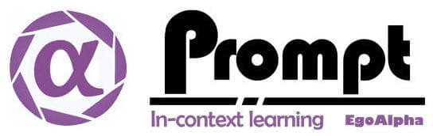

<div align="center">



**来自EgoAlpha实验室的开源提示上下文学习工程指南**

------

<p align="center">
  <a href="#Paper">论文</a> |
  <a href="./Playground.md">游乐场</a> |
  <a href="./Promptzoo.md">提示家园</a> |
  <a href="./chatgptprompt.md">ChatGPT 提示</a> 
</p>

</div>


> **⭐️ 亮点 ⭐️:** 为您提供快速学习有关提示工程的资源;助您熟练掌握ChatGPT, GPT3, FlanT5等大模型的使用技巧；同时，我们也提供了许多大型模型来执行不同模式的任务，如文本、视觉和音频。(这里需要重新整理)

这些模型可以用来：

* 📝 文本，用于文本分类、信息提取、问题回答、摘要、翻译、文本生成等任务，支持100多种语言。
* 🖼️ 图像，用于图像分类、对象检测和分割等任务。
* 🗣️ 音频，用于语音识别和音频分类等任务。（这里需要重新整理）

## 📢 最新消息

- [2023.3.4] 这个项目是由EgoAlpha实验室的刘宇教授领导和组织。

## 🌍 内容列表

- [示例](#⚡️-examples)
- [游乐场](#🔥playground)
- [论文](#📝-papers)
- [工具和库](#tools--libraries)
- [数据集](#datasets)
- [感谢](#🙏-acknowledgements)
- [贡献者](#🏋️‍️contributors)
---

## ⚡️ 示例

一些从[HuggingFace](https://github.com/huggingface/transformers)找来的示例 :

自然语言处理领域:
- [Masked word completion with BERT](https://huggingface.co/bert-base-uncased?text=Paris+is+the+%5BMASK%5D+of+France)
- [Name Entity Recognition with Electra](https://huggingface.co/dbmdz/electra-large-discriminator-finetuned-conll03-english?text=My+name+is+Sarah+and+I+live+in+London+city)
- [Text generation with GPT-2](https://huggingface.co/gpt2?text=A+long+time+ago%2C+)
- [Natural Language Inference with RoBERTa](https://huggingface.co/roberta-large-mnli?text=The+dog+was+lost.+Nobody+lost+any+animal)
- [Summarization with BART](https://huggingface.co/facebook/bart-large-cnn?text=The+tower+is+324+metres+%281%2C063+ft%29+tall%2C+about+the+same+height+as+an+81-storey+building%2C+and+the+tallest+structure+in+Paris.+Its+base+is+square%2C+measuring+125+metres+%28410+ft%29+on+each+side.+During+its+construction%2C+the+Eiffel+Tower+surpassed+the+Washington+Monument+to+become+the+tallest+man-made+structure+in+the+world%2C+a+title+it+held+for+41+years+until+the+Chrysler+Building+in+New+York+City+was+finished+in+1930.+It+was+the+first+structure+to+reach+a+height+of+300+metres.+Due+to+the+addition+of+a+broadcasting+aerial+at+the+top+of+the+tower+in+1957%2C+it+is+now+taller+than+the+Chrysler+Building+by+5.2+metres+%2817+ft%29.+Excluding+transmitters%2C+the+Eiffel+Tower+is+the+second+tallest+free-standing+structure+in+France+after+the+Millau+Viaduct)
- [Question answering with DistilBERT](https://huggingface.co/distilbert-base-uncased-distilled-squad?text=Which+name+is+also+used+to+describe+the+Amazon+rainforest+in+English%3F&context=The+Amazon+rainforest+%28Portuguese%3A+Floresta+Amaz%C3%B4nica+or+Amaz%C3%B4nia%3B+Spanish%3A+Selva+Amaz%C3%B3nica%2C+Amazon%C3%ADa+or+usually+Amazonia%3B+French%3A+For%C3%AAt+amazonienne%3B+Dutch%3A+Amazoneregenwoud%29%2C+also+known+in+English+as+Amazonia+or+the+Amazon+Jungle%2C+is+a+moist+broadleaf+forest+that+covers+most+of+the+Amazon+basin+of+South+America.+This+basin+encompasses+7%2C000%2C000+square+kilometres+%282%2C700%2C000+sq+mi%29%2C+of+which+5%2C500%2C000+square+kilometres+%282%2C100%2C000+sq+mi%29+are+covered+by+the+rainforest.+This+region+includes+territory+belonging+to+nine+nations.+The+majority+of+the+forest+is+contained+within+Brazil%2C+with+60%25+of+the+rainforest%2C+followed+by+Peru+with+13%25%2C+Colombia+with+10%25%2C+and+with+minor+amounts+in+Venezuela%2C+Ecuador%2C+Bolivia%2C+Guyana%2C+Suriname+and+French+Guiana.+States+or+departments+in+four+nations+contain+%22Amazonas%22+in+their+names.+The+Amazon+represents+over+half+of+the+planet%27s+remaining+rainforests%2C+and+comprises+the+largest+and+most+biodiverse+tract+of+tropical+rainforest+in+the+world%2C+with+an+estimated+390+billion+individual+trees+divided+into+16%2C000+species)
- [Translation with T5](https://huggingface.co/t5-base?text=My+name+is+Wolfgang+and+I+live+in+Berlin)

计算机视觉领域：
- [Image classification with ViT](https://huggingface.co/google/vit-base-patch16-224)
- [Object Detection with DETR](https://huggingface.co/facebook/detr-resnet-50)
- [Semantic Segmentation with SegFormer](https://huggingface.co/nvidia/segformer-b0-finetuned-ade-512-512)
- [Panoptic Segmentation with MaskFormer](https://huggingface.co/facebook/maskformer-swin-small-coco)
- [Depth Estimation with DPT](https://huggingface.co/docs/transformers/model_doc/dpt)
- [Video Classification with VideoMAE](https://huggingface.co/docs/transformers/model_doc/videomae)
- [Universal Segmentation with OneFormer](https://huggingface.co/shi-labs/oneformer_ade20k_dinat_large)

音频信息领域：
- [Automatic Speech Recognition with Wav2Vec2](https://huggingface.co/facebook/wav2vec2-base-960h)
- [Keyword Spotting with Wav2Vec2](https://huggingface.co/superb/wav2vec2-base-superb-ks)
- [Audio Classification with Audio Spectrogram Transformer](https://huggingface.co/MIT/ast-finetuned-audioset-10-10-0.4593)

多模态任务中：
- [Table Question Answering with TAPAS](https://huggingface.co/google/tapas-base-finetuned-wtq)
- [Visual Question Answering with ViLT](https://huggingface.co/dandelin/vilt-b32-finetuned-vqa)
- [Zero-shot Image Classification with CLIP](https://huggingface.co/openai/clip-vit-large-patch14)
- [Document Question Answering with LayoutLM](https://huggingface.co/impira/layoutlm-document-qa)
- [Zero-shot Video Classification with X-CLIP](https://huggingface.co/docs/transformers/model_doc/xclip)

### 🔥[游乐场](Playground.md)
游乐场展示了基于深度学习训练得到的大量的大模型，并提供了可访问的直达链接以及地址，方便大家的快速浏览和使用。点击[游乐场](Playground.md)即可访问. 

## 📜 论文
In Natural Language Processing:
- [Masked word completion with BERT](https://huggingface.co/bert-base-uncased?text=Paris+is+the+%5BMASK%5D+of+France)
- [Name Entity Recognition with Electra](https://huggingface.co/dbmdz/electra-large-discriminator-finetuned-conll03-english?text=My+name+is+Sarah+and+I+live+in+London+city)
- [Text generation with GPT-2](https://huggingface.co/gpt2?text=A+long+time+ago%2C+)
- [Natural Language Inference with RoBERTa](https://huggingface.co/roberta-large-mnli?text=The+dog+was+lost.+Nobody+lost+any+animal)
- [Summarization with BART](https://huggingface.co/facebook/bart-large-cnn?text=The+tower+is+324+metres+%281%2C063+ft%29+tall%2C+about+the+same+height+as+an+81-storey+building%2C+and+the+tallest+structure+in+Paris.+Its+base+is+square%2C+measuring+125+metres+%28410+ft%29+on+each+side.+During+its+construction%2C+the+Eiffel+Tower+surpassed+the+Washington+Monument+to+become+the+tallest+man-made+structure+in+the+world%2C+a+title+it+held+for+41+years+until+the+Chrysler+Building+in+New+York+City+was+finished+in+1930.+It+was+the+first+structure+to+reach+a+height+of+300+metres.+Due+to+the+addition+of+a+broadcasting+aerial+at+the+top+of+the+tower+in+1957%2C+it+is+now+taller+than+the+Chrysler+Building+by+5.2+metres+%2817+ft%29.+Excluding+transmitters%2C+the+Eiffel+Tower+is+the+second+tallest+free-standing+structure+in+France+after+the+Millau+Viaduct)
- [Question answering with DistilBERT](https://huggingface.co/distilbert-base-uncased-distilled-squad?text=Which+name+is+also+used+to+describe+the+Amazon+rainforest+in+English%3F&context=The+Amazon+rainforest+%28Portuguese%3A+Floresta+Amaz%C3%B4nica+or+Amaz%C3%B4nia%3B+Spanish%3A+Selva+Amaz%C3%B3nica%2C+Amazon%C3%ADa+or+usually+Amazonia%3B+French%3A+For%C3%AAt+amazonienne%3B+Dutch%3A+Amazoneregenwoud%29%2C+also+known+in+English+as+Amazonia+or+the+Amazon+Jungle%2C+is+a+moist+broadleaf+forest+that+covers+most+of+the+Amazon+basin+of+South+America.+This+basin+encompasses+7%2C000%2C000+square+kilometres+%282%2C700%2C000+sq+mi%29%2C+of+which+5%2C500%2C000+square+kilometres+%282%2C100%2C000+sq+mi%29+are+covered+by+the+rainforest.+This+region+includes+territory+belonging+to+nine+nations.+The+majority+of+the+forest+is+contained+within+Brazil%2C+with+60%25+of+the+rainforest%2C+followed+by+Peru+with+13%25%2C+Colombia+with+10%25%2C+and+with+minor+amounts+in+Venezuela%2C+Ecuador%2C+Bolivia%2C+Guyana%2C+Suriname+and+French+Guiana.+States+or+departments+in+four+nations+contain+%22Amazonas%22+in+their+names.+The+Amazon+represents+over+half+of+the+planet%27s+remaining+rainforests%2C+and+comprises+the+largest+and+most+biodiverse+tract+of+tropical+rainforest+in+the+world%2C+with+an+estimated+390+billion+individual+trees+divided+into+16%2C000+species)
- [Translation with T5](https://huggingface.co/t5-base?text=My+name+is+Wolfgang+and+I+live+in+Berlin)

In Computer Vision:
- [Image classification with ViT](https://huggingface.co/google/vit-base-patch16-224)
- [Object Detection with DETR](https://huggingface.co/facebook/detr-resnet-50)
- [Semantic Segmentation with SegFormer](https://huggingface.co/nvidia/segformer-b0-finetuned-ade-512-512)
- [Panoptic Segmentation with MaskFormer](https://huggingface.co/facebook/maskformer-swin-small-coco)
- [Depth Estimation with DPT](https://huggingface.co/docs/transformers/model_doc/dpt)
- [Video Classification with VideoMAE](https://huggingface.co/docs/transformers/model_doc/videomae)
- [Universal Segmentation with OneFormer](https://huggingface.co/shi-labs/oneformer_ade20k_dinat_large)

In Audio:
- [Automatic Speech Recognition with Wav2Vec2](https://huggingface.co/facebook/wav2vec2-base-960h)
- [Keyword Spotting with Wav2Vec2](https://huggingface.co/superb/wav2vec2-base-superb-ks)
- [Audio Classification with Audio Spectrogram Transformer](https://huggingface.co/MIT/ast-finetuned-audioset-10-10-0.4593)

In Multimodal tasks:
- [Table Question Answering with TAPAS](https://huggingface.co/google/tapas-base-finetuned-wtq)
- [Visual Question Answering with ViLT](https://huggingface.co/dandelin/vilt-b32-finetuned-vqa)
- [Zero-shot Image Classification with CLIP](https://huggingface.co/openai/clip-vit-large-patch14)
- [Document Question Answering with LayoutLM](https://huggingface.co/impira/layoutlm-document-qa)
- [Zero-shot Video Classification with X-CLIP](https://huggingface.co/docs/transformers/model_doc/xclip)

<!-- ## 🛠 示例Development Setup
示例
```console
  npm install
  npm run dev
``` -->

<!-- ## ⭐️ 示例Embedding Into Your Website
示例

A [`Dockerfile`](Dockerfile) is provided in the root of the repository.
If you want to run JSON Crack locally:

* Build a Docker image with `docker build -t jsoncrack .`
* Run locally with `docker run -p 8888:8080 jsoncrack`
* Go to http://localhost:8888 -->

<!-- ## ⚡️ 示例Key Features
示例
- Search Nodes
- Share links & Create Embed Widgets
- Download/Clipboard as image
- Upload JSON locally or fetch from URL
- User-friendly Interface
- Light/Dark Mode -->

## 🎓 引用

如果您认为我们的工作对您有帮助，您也可以访问我们的项目主页并引用我们的论文作品，非常感谢！

```
综述论文可以放在这个位置
```

## ✉️ 联系我们

这个仓库由[EgoAlpha](https://github.com/EgoAlpha)实验室维护，问题以及讨论可以随时联系`cyfedu1024@gmail.com`. 我们乐意与您以及您的团队在各个领域开展深入的交流与合作。

## 🙏 感谢

【Thanks to [EgoAlpha Lab](https://github.com/EgoAlpha) for the help with XXX and [who](https://github.com/xxx) for the help with A工作 and B 工作.】/【Thanks to the XXX modeule.】/ [We use the implemention of XXX from https://xxx.xxx]


## 🏋️‍️贡献者

### 主要贡献者
* [Zhang san](https://martin-danelljan.github.io/)  
* [Li si](https://goutamgmb.github.io/)
* [Wang wu](https://2006pmach.github.io/)

### 游客贡献者
* [孙尚香](https://liu.se/en/employee/felja34)


## 执照

This project is open source and available under the MIT
