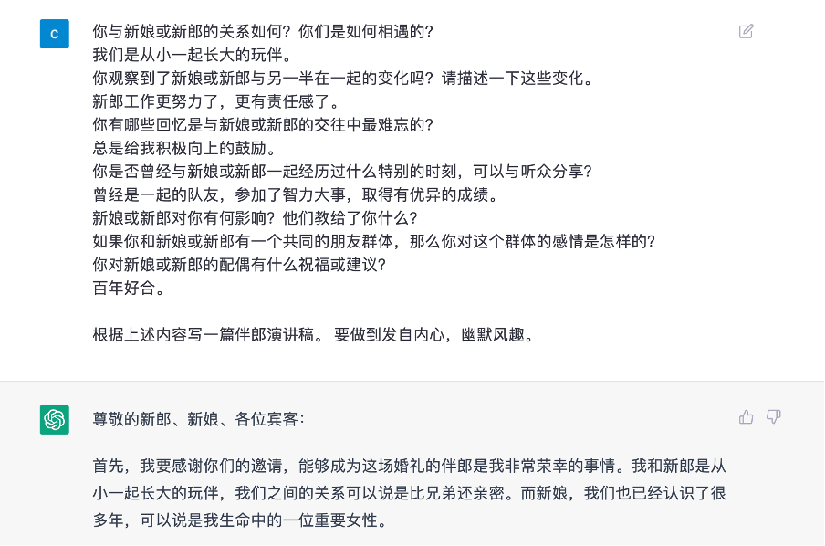
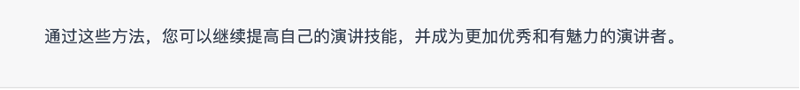

# 🌋 ChatGPT Prompts <a href="./chatgptprompt.md">👉English👈</a>

## ChatGPT是一款基于人工智能技术的语言模型，它可以用自然语言与人类进行交互，理解人类的问题并生成响应的答案。ChatGPT的出现将给我们的生活和工作带来重大变革。ChatGPT不仅仅是一个聊天机器人，通过更好的输入提示（Prompt）设计，它能够帮助我们学习、协助工作，丰富我们的经验，可以大大增强我们的能力。


> **[注意⚠️](#🌋-chatgpt-prompt)**: ChatGPT可能会产生错误、有害或带有偏见的信息。虽然ChatGPT不是很完美，但它无疑是一个非常有用的工具。ChatGPT可以为我们提供一个很好的起点，让我们更容易应对挑战，并让我们在奋斗的道路上不再孤单。

## 🗻 让我们开始成为超级学习者的神奇旅程吧！💪


## 🌍 目录 

- [帮助我们学习](#帮助我们学习)
    - [学习编程](#学习编程)
    - [学习厨艺](#学习厨艺)
- [协助我们工作](#协助我们的工作)
    - [协助软件开发](#协助软件开发)
    - [视频编辑](#视频编辑)
- [丰富我们的经验](#丰富我们的经验)
    - [模拟面试](#模拟面试)
    - [演讲稿设计](#演讲稿设计)


下面是在各种场景下，如何使用ChatGPT的例子。

## 帮助我们学习
ChatGPT可以作为一名老师或教学助手，不论你是在尝试学习一门新语言，理解一个复杂的主题，还是提高自己的技能水平，它都能够为我们提供帮助。

### 学习编程 

- 创建学习路线图：Chat GPT 可以提供个性化的学习路线图，帮助用户学习编程概念和技能。这包括根据用户的技能水平、兴趣和学习目标，建议相关的课程、书籍、教程和在线资源。

    - 👁️ **[输入到ChatGPT]:** ```我想学习[python,Java C++, C]进行[数据分析]，您能创建一个[3个月]的周计划学习路线图吗？每周包括资源和链接。```

- 语言理解：Chat GPT 具有理解和处理自然语言的能力，可以帮助初学者以易于理解的方式学习编程概念。
    
    - 👁️ **[输入到ChatGPT]:**```您能简单解释[面向对象编程]吗？```

- 代码解释：Chat GPT 可以提供复杂编程概念的解释，帮助用户理解某些代码的工作原理和原因。

    - 👁️ **[输入到ChatGPT:]**```您能解释递归在编程中的工作原理并提供一个例子吗？```

- 代码片段：Chat GPT 可以提供代码片段，快速、简单地解决编程问题。这些片段可以根据需要进行定制和重复使用。

    - 👁️ **[输入到ChatGPT]**:```您能提供一个在 Python 中生成1到100之间的随机数的代码片段吗？```

- 语言翻译：Chat GPT 可以将编程代码从一种语言翻译成另一种语言。这在处理其他人编写的代码或与不同地区的开发人员合作时特别有帮助。

    - 👁️ **[输入到ChatGPT]**:```我有一些需要翻译成 JavaScript 的 Python 代码，你能帮我吗？{贴上你自己的代码}```

-  上下文建议：Chat GPT 可以针对特定任务提供上下文相关的建议，例如建议解决特定问题的最佳方法。

    - 👁️ **[输入到ChatGPT]**:```优化网站运行速度的最佳方法是什么?```

- 调试协助：Chat GPT 可以通过指出代码中的错误、建议可能的解决方案以及提供进一步学习的资源来协助调试。

    - 👁️ **[输入到ChatGPT]**:```我正在尝试运行我的[python,Java C++, C]程序，但它一直出错。你能帮我找出问题的原因吗？{贴上你自己的代码}```

- 语法高亮：Chat GPT 可以突出显示语法错误，更容易发现代码中的问题。它还可以突出显示重要的代码元素，如函数、变量和循环。
   
    - 👁️ **[输入到ChatGPT]**:```您能帮我识别这个 JavaScript 代码中的语法错误吗？{贴上你自己的代码}```

- 代码优化：Chat GPT可以提供代码优化建议，这对于试图编写高效程序的初学者非常有帮助。
    
    - 👁️ **[输入到ChatGPT]**:```我有一个Python程序，执行时间很长。你能否提供优化的建议并提高程序的性能？{贴上你自己的代码}```

- 交互式示例：Chat GPT可以提供交互式示例，让初学者尝试不同的编码概念，并实时查看它们的工作方式。
    
    - 👁️ **[输入到ChatGPT]**:```你能否提供一个交互式的JavaScript示例，演示如何使用循环迭代数组并对每个元素执行操作？```

### 学习厨艺

- 食谱建议：ChatGPT可以根据原料、菜肴和烹饪时间来推荐食谱。

    - 👁️ **[输入到ChatGPT]**:```我有一些吃剩的鸡肉和甜椒。你能建议一个包含这些成分的食谱吗？```
    
    

- 成分替代:ChatGPT可以因食材限制和个人喜好而推荐替代品，这在紧要关头或适应饮食限制时很有用。
    - 👁️ **[输入到ChatGPT]**:```我的厨房里没有任何鸡蛋。您能建议在烘焙中使用鸡蛋的替代品吗？```
    

- 烹饪技巧:烹饪技巧和窍门，ChatGPT从点滴中传授给你，如：如何正确调味一道菜，如何准备原料以及如何调整烹饪时间和温度。

    - 👁️ **[输入到ChatGPT]**:```您能提供一些烹饪完美牛排的技巧吗？```
    

- 膳食计划: ChatGPT根据您的饮食需求和偏好，ChatGPT会给出合理的膳食计划，并根据所选食谱为您创建一份食品清单。

    - 👁️ **[输入到ChatGPT]**:```您能建议一个素食和高蛋白的一周的膳食计划吗```
    
    
    

- 烹饪术语: ChatGPT可以解释可能不熟悉的烹饪术语和技术，帮助揭开烹饪过程的神秘面纱，使其更容易理解。

    - 👁️ **[输入到ChatGPT]**:```我是烹饪新手，我不知道"氽烫"蔬菜是什么意思。你能解释一下这个烹饪术语吗？```
    

- 营养信息:ChatGPT可以提供菜谱的营养信息，如卡路里数、宏量营养素分类和过敏原警告等。

    - 👁️ **[输入到ChatGPT]**:```我需要知道这个食谱的营养信息。水煮牛肉。```
    
    

- 成分搭配:ChatGPT可以根据互补的口味和质地，建议食材的搭配，帮助您创造出营养均衡的菜肴。

    - 👁️ **[输入到ChatGPT]**:```请给我一些互补口味和质地的食材搭配建议，以帮助我创造出一道均衡的菜肴。```
    

- 烹饪设备: ChatGPT可以为特定的食谱或技术推荐烹饪设备和工具，如将蔬菜切成薄片的曼陀林或精确烹饪的苏式蒸煮机。

    - 👁️ **[输入到ChatGPT]**:```我想从头开始做自制意大利面。你能推荐我完成这项任务所需的必要烹饪设备和工具吗？```
    

- 地区美食: ChatGPT可以向您介绍新的和多样化的地区美食，并提供有关其历史、成分和准备方法的信息。

    - 👁️ **[输入到ChatGPT]**:```我对探索南美洲的地区美食感兴趣。你能推荐一些该地区的传统菜肴，并提供有关其历史和成分的信息吗？```
    

- 食品安全: ChatGPT可以提供有关食品安全的信息，如：如何正确储存和处理食物；如何避免交叉污染。

    - 👁️ **[输入到ChatGPT]**:```我这个周末要举办烧烤活动，想确保我正确处理和储存食物。你能为我提供一些我应该遵循的食品安全提示和准则，以确保我的客人不会生病```
    


## 协助我们的工作

ChatGPT可以成为我们的个人助手，协助我们的工作，管理日常任务和组织日程安排。

### 协助软件开发

- 代码生成：Chat GPT可以根据提示生成代码片段。这个功能可以帮助自动化重复的编码任务，创建样板代码，或生成测试用的示例代码。

    - 👁️ **[输入到ChatGPT]**:```使用Pillow库生成一个Python中调整图像大小的代码片段。```

- 语言翻译：Chat GPT可以翻译编程语言，使得开发人员可以在不同的编码语言之间轻松工作。例如，一个在Python中工作的开发人员可以使用Chat GPT将JavaScript编写的代码翻译成Python，反之亦然。

    - 👁️ **[输入到ChatGPT]**:```将一个用于训练图像识别模型的TensorFlow代码从Python翻译到JavaScript。```

- 调试协助：Chat GPT可以分析代码并提供如何修复错误或优化代码的建议。这个功能可以帮助在调试复杂代码时节省时间和提高效率。

    - 👁️ **[输入到ChatGPT]**:```分析以下代码并建议如何修复错误：ValueError: The truth value of an array with more than one element is ambiguous. Use a.any() or a.all()```

- 自然语言处理：Chat GPT可以解释自然语言查询并提供相关的代码片段或文档。这个功能可以为那些新接触某个特定语言或框架的开发人员提供帮助，帮助他们找到正确的语法或文档。

    - 👁️ **[输入到ChatGPT]**:```提供一个使用PyTorch库来加载和处理图像以进行图像识别的代码示例。```

- 个性化的代码推荐：Chat GPT可以分析开发人员的代码历史记录，并为开发人员的项目提供个性化的库、框架或设计模式建议。这个功能可以帮助开发人员跟上软件开发的最新趋势和最佳实践。
   
    - 👁️ **[输入到ChatGPT]**:```根据我最近的图像识别项目，建议一个新的库或算法，我可能会发现它有用。```

- 代码补全：Chat GPT可以根据正在编写的代码的上下文建议代码完成。这个功能可以帮助减少编写代码所需的时间，同时防止语法错误。

    - 👁️ **[输入到ChatGPT]**:```为以下Python函数生成代码补全，该函数从文件加载图像：def load_image(file_path):```

- 文档生成：Chat GPT可以根据代码中的注释或注解生成文档。这个功能可以帮助确保代码具有良好的文档记录并且可以随着时间的推移而维护。

    - 👁️ **[输入到ChatGPT]**:```为一个使用TensorFlow框架来对图像进行分类的Python文件生成对应的说明文档。```

- 代码摘要：Chat GPT能够对大型代码库或复杂函数进行摘要，为开发人员提供快速的代码概述。这个功能可以帮助开发人员更快地理解代码库，并做出关于重构或修改代码的明智决策。

    - 👁️ **[输入到ChatGPT]**:```用一句话总结以下Python函数的目的：def preprocess_image(image):```

- 代码优化：Chat GPT可以分析代码并建议优化方案，以提高性能或减少资源使用。这个功能可以帮助开发人员创建更高效、更快速、更可扩展的代码。

    - 👁️ **[输入到ChatGPT]**:```分析这个TensorFlow代码，并建议如何优化它以获得更好的性能：model.fit(train_dataset, epochs=10, validation_data=val_dataset)```

- 自动化测试：Chat GPT可以基于给定的输入或预期的输出生成测试用例或测试代码。这个功能可以帮助自动化测试过程，确保代码是功能齐全且没有错误。

    - 👁️ **[输入到ChatGPT]**:```生成一个测试用例，检查一个Python函数是否正确地将图像分类为猫或狗。```

### 视频编辑

- 整合构思，生成创意：使用Chat GPT的内容生成功能，想出新的视频创意。

    - 👁️ **[输入到ChatGPT]**:```作为一个YouTube内容创作者，你总是在寻找新鲜的想法来吸引你的观众。使用Chat GPT的内容生成功能，想出新的视频创意。只需输入一些关键词，剩下的就让模型来完成，分享一些可能的创意想法。关键词。 {粘贴你的关键字}```
    

- 脚本生成，轻松get视频的内容和结构。

    - 👁️ **[输入到ChatGPT]**:```以制作素食千层面为例。脚本应包括分步说明、配料表和每个步骤的烹饪时间。其中不仅要强调制作美味素食千层面的任何特殊技术或技巧，还应照顾到受饮食限制困扰的观众，并为其提供替代成分的选择。```
    
    
    
    

- 提升受众参与度。ChatGPT可以生成观众对视频的评论和问题，并对观众形成个性化的回应，增加时效性。

    - 👁️ **[输入到ChatGPT]**:```作为一个内容创作者，您刚刚在社交媒体平台上发布了一个新的视频，您的观众已经开始留下评论和反馈。使用ChatGPT生成个性化的回复，与你的观众互动，并向他们表明你重视他们的意见。```
    

- 内容优化。ChatGPT根据现有内容提供发现性的见解，从而改善所有可以改善提升的内容。

    - 👁️ **[输入到ChatGPT]**:```你是一个内容创作者，想提高你视频的参与度和可发现性。使用Chat GPT来分析您现有的内容，并提供关于如何优化的见解。采纳其建议，改善您的视频标题、描述、标签和内容，以更好地接触和吸引您的目标受众。你现有的内容：{粘贴你的视频文字记录}```
    
    
    

- 趋势分析。ChatGPT可以帮助你在你兴趣领域上保持最新的趋势和话题；可以分析社交媒体和新闻提要，确定热门话题，并根据这些话题产生内容创意。

    - 👁️ **[输入到ChatGPT]**:```作为你的兴趣领域的内容创造者，重要的是保持最新的趋势和话题，以保持你的内容的相关性和吸引力。使用ChatGPT分析社交媒体和新闻源，并根据你的兴趣领域的流行趋势和话题产生内容想法。你的兴趣领域是关于：{提供一些关键词}。```
    

- 缩略图生成。ChatGPT可以为你的视频生成醒目的缩略图，更容易吸引点击和浏览；可以分析你的视频内容，并建议可能吸引注意力的视觉元素。

    - 👁️ **[输入到ChatGPT]**:```为一个视频创建一个引人注意的缩略图。该视频的文字记录如下。{贴上你的文字记录}。```
    
    


## 丰富我们的经验

ChatGPT可以根据我们独特的背景、经验和需求提供个性化建议。并可以根据我们指定的场景，进行各种模拟互动来丰富我们的经验。 

### 模拟面试

- 行业特定知识：Chat GPT可以提供用户行业或职位的专业见解和知识。这可能包括关于行业趋势、最佳实践和挑战的信息，可以帮助用户在面试中展示他们的知识和专业能力。

    - 👁️ **[输入到ChatGPT]**:```你正在为一份[初级软件工程师职位]的面试做准备。展示你对最新趋势和最佳实践的了解。```

- 面试问题准备：Chat GPT可以根据用户的职位或行业生成常见的面试问题清单。AI还可以提供关于如何构建和回答问题的建议。

    - 👁️ **[输入到ChatGPT]**:```你正在为一份[市场营销]的工作面试做准备。确保你准备好迎接任何问题。```

- 行为面试练习：Chat GPT可以通过询问用户关于他们过去经历和行为的问题来模拟行为面试。这可以帮助用户准备面对现实生活中越来越注重行为和情境问题的面试。

    - 👁️ **[输入到ChatGPT]**:```你被邀请参加一份[项目经理]职位的行为面试，想确保你做好了准备。```

- 角色扮演场景：Chat GPT可以帮助用户为他们在面试过程中可能遇到的特定情境做准备，如困难问题或假设情境。AI可以就用户的回答提供反馈并建议替代方法。

    - 👁️ **[输入到ChatGPT]**:```你正在为一份[销售]的工作面试做准备，想要做好任何情境的准备。```

- 模拟面试练习：Chat GPT可以与用户进行模拟面试，根据工作描述或行业向他们提问一系列问题。这可以帮助用户练习他们的回答，并在需要改进的领域获得反馈。

    - 👁️ **[输入到ChatGPT]**:```我正在为一份即将到来的[人力资源]职位的面试做准备，想要模拟一次模拟面试来练习我的回答。我希望你只作为面试官回复。请像面试官一样逐个问题地问我，并等待我的回答。```

- 面试反思：Chat GPT可以帮助用户反思面试，提供反思机会，让用户反思表现得如何，以及可以改进的地方。AI还可以提供反馈用户表现的意见，并建议未来面试的策略。

    - 👁️ **[输入到ChatGPT]**:```我刚刚完成了一次[市场营销]职位的面试。我想反思一下我的表现。```

- 面试后续：Chat GPT可以提供有关如何跟进面试的指导，例如发送感谢电子邮件或便条的方式。AI还可以提供如何重申用户对工作的兴趣和突出自己的资格的建议。

    - 👁️ **[输入到ChatGPT]**:```我刚刚完成了一次[金融]职位的面试，想知道如何跟进招聘经理。您能给我一些有效的建议吗？```

- 薪资谈判：Chat GPT可以提供薪资谈判方面的指导，例如如何研究薪资范围和有效地进行谈判。AI还可以提供在面试过程中何时以及如何谈论薪资的建议。

    - 👁️ **[输入到ChatGPT]**:```我收到了一份[产品经理]职位的工作邀请，但我不确定如何谈判薪资。您能给我提供一些有效的建议吗？```

- 文化适配评估：Chat GPT可以帮助用户评估公司文化和价值观，以确定它们是否与自己的价值观相符。这对于帮助用户准备与公司文化相关的问题，并确定他们是否适合该组织非常有用。

    - 👁️ **[输入到ChatGPT]**:```我正在为一个[非营利组织]面试，想评估公司文化是否与我的个人价值观相符。您能给我一些有效的指导吗？```

- 面试礼仪：Chat GPT可以提供有关适当的面试礼仪的指导，例如如何着装、准时到达和问候面试官。

    - 👁️ **[输入到ChatGPT]**:```有哪些适合面试的着装提示？```

### 演讲稿设计

- 演讲稿写作。ChatGPT组织我们的思想、集思广益，为我们的演讲出谋划策。

    - 👁️ **[输入到ChatGPT第一轮示例]**:```我需要帮助写关于朋友婚礼的演讲稿。请提示我一些问题来创作演讲稿。```
    
    
    - 👁️ **[输入到ChatGPT第二轮示例]**:```根据上述内容写一篇伴郎演讲稿。要做到发自内心，幽默风趣。```
    
    

- 演讲分析。ChatGPT会通过分析演讲者的优势和劣势，制定有针对性的演讲模式。

    - 👁️ **[输入到ChatGPT]**:```分析演讲内容，并对我的演讲风格提供反馈，包括优势领域和需要改进的地方。根据这一分析，今后应采取哪些措施来提高我的演讲技巧？我的演讲是：{粘贴你的演讲稿}。```
    
    
    

- 受众分析。ChatGPT会对预期的听众深入了解他们的兴趣和喜好而定制演讲。

    - 👁️ **[输入到ChatGPT]**:```想象一下，你正在给一群潜在的投资者做一个关于新产品的演讲。这些投资者都是具有金融背景的技术专家。你将如何调整你的演讲以吸引这些听众？基于对听众的分析，直接修改你的演讲稿。 你原来的演讲稿是：{粘贴你的演讲稿}。```
    
    

- 幽默。ChatGPT可以帮助我们将幽默融入你的演讲中，使其更有吸引力，更令人难忘。

    - 👁️ **[输入到ChatGPT]**:```请将幽默融入我的演讲中，使其更有吸引力，更令人难忘。我的演讲稿是。{粘贴你的演讲稿}.```
    
    

- 类比和隐喻。ChatGPT可以教我们如何使用类比和隐喻，以简单和亲近的方式传达复杂的想法。

    - 👁️ **[输入到ChatGPT]**:```请在我的演讲中加入类比和隐喻，使其更容易理解我的演讲稿是 {粘贴你的演讲稿}.```
    
    

- 互动对话。ChatGPT可以让我们参与互动对话，让我们在自然和轻松的环境中练习演讲。

    - 👁️ **[输入到ChatGPT]**:```在我的模拟演讲中，我将接受观众可能出现的问题。观众将有机会提问，我将提供答案。我的演讲稿是 {粘贴你的演讲稿}.```
    
    

- 建立信心。ChatGPT可以帮助我们建立对演讲的信心，提供积极的反馈和鼓励，帮助我们克服恐惧和焦虑的情绪。

    - 👁️ **[输入到ChatGPT]**:```我对公开演讲感到很紧张，但我想知道我是否能做到。我对公开演讲感到紧张，希望得到一些鼓励和积极的反馈来帮助我建立信心。请引导我克服我的恐惧和焦虑。```
    

- 公开演讲技巧。ChatGPT可以为我们提供成功公开演讲的技巧和策略，如：如何吸引观众，如何有效地使用身体语言，以及如何处理紧张情绪。

    - 👁️ **[输入到ChatGPT]**:```请为我提供成功公开演讲的技巧和策略。```
    

- 词汇积累。ChatGPT可以建议将新的词汇和短语纳入我们的演讲中，并提供定义和例子以帮助我们理解和正确使用它们。

    - 👁️ **[输入到ChatGPT]**:```请向我推荐一些新的单词和短语，以纳入我的演讲中。我的演讲稿是。{粘贴你的演讲稿}。```
    

- 语法和句法帮助。ChatGPT可以帮助我们确保我们的演讲在语法上的正确性和结构上的合理性。它可以提供关于句子结构、词汇选择和其他语法元素的反馈。

    - 👁️ **[输入到ChatGPT]**:```请对句子结构、词语选择和其他语法元素提供反馈。我的演讲稿是{粘贴你的演讲稿}.```
    

> 如果您对该项目更多内容感兴趣，可以参照英文主页[README.md](./README.md)，详细内容暂时先以英文形式开放与浏览，后续逐步开放所有信息的中文版本方便读者深入学习。敬请谅解，再次感谢！
